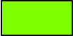
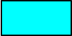
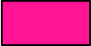
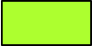
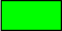
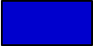
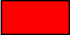
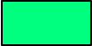
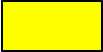

More information coming soon...  
For now, a list of the pre-defined ColorMaker colors is shown below. Any of these colors can be used like this:
```scala
// draw an aliceBlue line
setPenColor(cm.aliceBlue)
forward(100)
```
### Pre-defined ColorMaker colors

aliceBlue  


antiqueWhite  


aqua  


aquamarine  


azure  


beige  


bisque  


black  


blanchedAlmond  


blue  


blueViolet  


brown  


burlyWood  


cadetBlue  


chartReuse  


chocolate  


coral  


cornSilk  


cornflowerBlue  


crimson  


cyan  


darkBlue  


darkCyan  


darkGoldenrod  


darkGray  


darkGreen  


darkGrey  


darkKhaki  


darkMagenta  


darkOliveGreen  


darkOrange  


darkOrchid  


darkRed  


darkSalmon  


darkSeaGreen  


darkSlateBlue  


darkSlateGray  


darkSlateGrey  


darkTurquoise  


darkViolet  


deepPink  


deepSkyBlue  


dimGray  


dimGrey  


dodgerBlue  


fireBrick  


floralWhite  


forestGreen  


fuchsia  


gainsboro  


ghostWhite  


gold  


goldenrod  


gray  


green  


greenYellow  


grey  


honeydew  


hotpink  


indianRed  


indigo  


ivory  


khaki  


lavender  


lavenderBlush  


lawngreen  


lemonChiffon  


lightBlue  


lightCoral  


lightCyan  


lightGoldenrodYellow  


lightGray  


lightGreen  


lightGrey  


lightPink  


lightSalmon  


lightSeaGreen  


lightSkyBlue  


lightSlateGray  


lightSlateGrey  


lightSteelBlue  


lightYellow  


lime  


limeGreen  


linen  


magenta  


maroon  


mediumAquamarine  


mediumBlue  


mediumOrchid  


mediumPurple  


mediumSeaGreen  


mediumSlateBlue  


mediumSpringGreen  


mediumTurquoise  


mediumVioletRed  


midnightBlue  


mintCream  


mistyRose  


moccasin  


navajoWhite  


navy  


oldLace  


olive  


oliveDrab  


orange  


orangeRed  


orchid  


paleGoldenrod  


paleGreen  


paleTurquoise  


paleVioletRed  


papayaWhip  


peachPuff  


peru  


pink  


plum  


powderBlue  


purple  


red  


rosyBrown  


royalBlue  


saddleBrown  


salmon  


sandyBrown  


seaGreen  


seaShell  


sienna  


silver  


skyBlue  


slateBlue  


slateGray  


slateGrey  


snow  


springGreen  


steelBlue  


tan  


teal  


thistle  


tomato  


turquoise  


violet  


wheat  


white  


whiteSmoke  


yellow  


yellowGreen  

