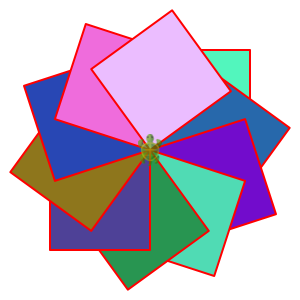
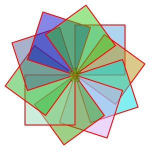
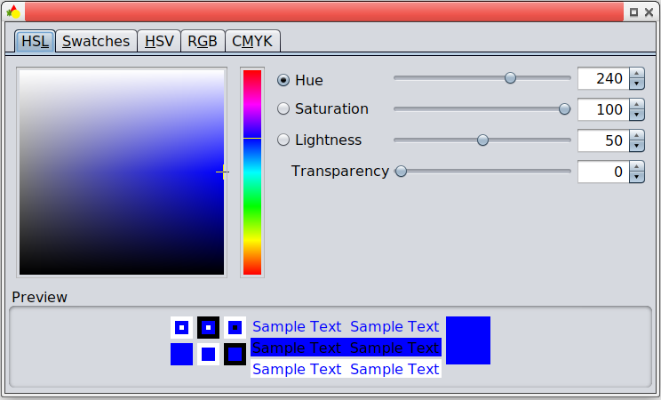

<div class="nav">
  <a href="../index.html">Home</a> | <a href="../fundamentals-index.html">Fundamentals</a>
</div>

You can use colors in Kojo in the following ways:

* [Random Colors](#random-colors)  
* [Predefined Colors](#predefined-colors)  
* [Custom Colors](#custom-colors)
* [Color Gradients](#color-gradients)

### Random Colors
Wherever a color is needed in your program, you can use the `randomColor` function. For example:
```scala
clear()
setSpeed(fast)
repeat(10) {
    setFillColor(randomColor)
    repeat(4) {
        forward(100)
        right(90)
    }
    right(36)
}
```


If you are making overlapping figures (like in the drawing above), you can make your random colors transparent by using the `randomColor.fadeOut(fraction)` function. The fadeout fraction is a value between 0.0 and 1.0. A fadeout of 1.0 means that the random color is totally transparent, while a fadeout of 0.0 means that the random color is totally opaque. Values betwen these extremes let you control the effect that you want:
*  a fadeout of 0.9 gives you a highly transparent color
*  a fadeout of 0.1 gives you a slightly transparent color
*  a fadeout of 0.5 gives you a medium transparent color

```scala
clear()
setSpeed(fast)
repeat(10) {
    setFillColor(randomColor.fadeOut(0.5))
    repeat(4) {
        forward(100)
        right(90)
    }
    right(36)
}
```



### Predefined Colors
[Here's a list of all the predefined ColorMaker colors](predefined-colors.html).

### Custom Colors
Once a predefined color has been used in the script editor, you can `Ctrl+Click` on it to bring up the color chooser:



In the color chooser, you can adjust the hue, saturation, lightness, and transparency of your desired color:
* Choose the basic color (a number between 0 and 360) via the **Hue** slider. 0 is red, 120 is green, 240 is blue, and 360 is again red.
* Add gray to this color via the **Saturation** slider. 100 is the pure color; 50 is half color and half gray; 0 is fully gray.
* Add white or black to the color via the **Lightness** slider. 50 is the pure color; numbers greater than 50 add more and more white. Numbers less than 50 add more and more black.
* Increse the transparency of the color via the **Transparency** slider.

### Color Gradients
Todo