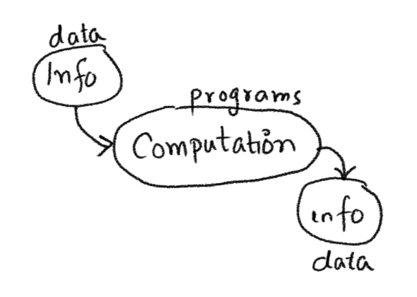
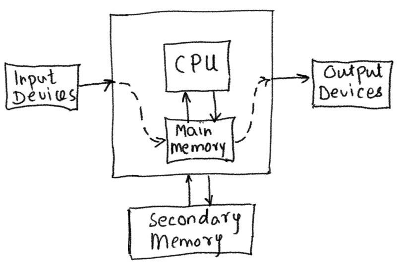
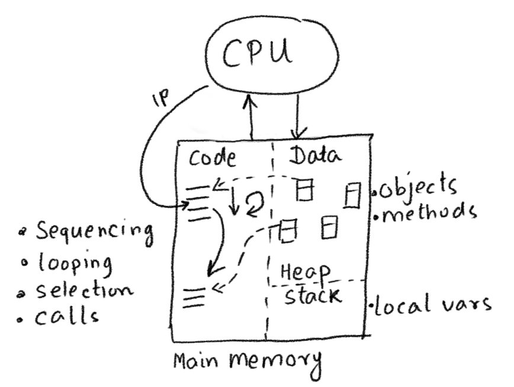

<div class="nav">
  <a href="../index.html">Home</a> | <a href="../gaming-index.html">Gaming</a> | <a href="../fundamentals-index.html">Fundamentals</a>
</div>

## Computing essentials for Kojo

Here's the absolute minimum amount of programming theory and Scala information that you need to know to write interesting programs as you move beyond turtle graphics.
* [Computing Fundamentals](#computing-fundamentals)
* [Program Structure](#program-structure)
* [Program Operation](#program-operation)
* [Program Development](#program-development)
* [Kojo Primitives](#kojo-primitives)
* [Composition](#composition)
* [Abstraction](#abstraction)
* [An Example](#an-example)
* [Scala Quickref](../reference/scala.html)
* [How-tos](../howtos/gaming.html)

### Computing Fundamentals
So what's a computer?  
The literal answer is - a device for doing computations.

And what is a computation?  
A computation takes in information and spits out new infomation.



That's the abstract idea. Actual physical computations are carried out by an electronic computer. Here's an idealised view of one:



So an electronic computer basically does the following (as per the program running on it):
* It takes in information from an input device into main memory.
* It has the CPU work on this input information (from main memory) to generate new information (which is put back into main memory). The new information is of two kinds - intermediate calculations (which feed back as input into more computations), and output information.
* The computer takes the output information from main memory and writes it to an output device.
* It saves some of the output information (which needs to survive a computer restart) to secondary storage.

Let's zoom into the CPU and main memory:



* Memory is divided into two sections - code and data.
* When you run a program, the instructions of the program are loaded into the code section.
* The CPU has an instruction pointer (IP) that points to the next instruction that it is going to run. After a program is loaded, the IP points to the first instruction in the program.
* As the clock cycle on the computer drives the CPU forward, it runs the instructions in the program one after the other. The instructions are run in sequence, but special instructions in your program make the CPU also do - looping (via repeat), selection(via if/else), and calls (via function/command usage).
* Code works on data (it takes it in as input and generates it as output).
* When you run a program, the data in it is loaded into the data section.
* The data section is divided into two parts - the stack (where the local variables live), and the heap, where the data/objects live. Don't worry about this for now.
* Every data value (in Scala) is an object - it contains a reference to the code that can work with it. 
 
This is the physical setting in which computer programs run.

### Program Structure
* A program is a sequence of lines of text.
* Each line contains instructions for the computer. These instructions can be of the following kinds:
  * Commands - which let you take output actions that can be sensed in the external world (e.g. `forward(100)`, `println(10)`), or indirectly affect future actions (e.g. `setPenColor(blue)`).  
  Note - a couple of other names are also used for commands - *statements* and *procedures*.
  * Expressions - which are portions of your program text that can be evaluated to produce a value. Expressions are of two kinds:
    * Functions - which take input values and compute output or return values from these inputs (e.g. `math.round(11.1)`, `math.pow(2, 3)`).
    * Literals - which evaluate to themselves (e.g. `9`, `7.1`, `blue`, `"hello"`, `List(1, 2, 3)`).
  * Keyword instructions - which have special meaning in Scala, and which let you structure your programs by combining existing instructions (e.g. `val`, `var`, `def`). At the end of the day, keyword instructions behave mostly like commands (and are called statements in this context).
  * Queries - which let you access (potentially changing) values in the program's environment (e.g. `position`, `heading`, `readInt("Enter a number")`, `random(10`). A query is like a function in that it returns a value, but is different from a function in that it returns a different output value each time it is used with the same input value(s). You can think of a query as an *impure* function.

*Notes:*
* The instructions in your program make use of data values to do their jobs. More on this in the *program operation* section below.
* You **use** a command or function in your program by **calling** it with (optional) input data.
* Commands also return output values! It's just that each and every command returns the exact same output value - called unit (written `()`). The type of this unit value `()` is `Unit`. You can think of `()` as a value that contains *no information*.
* Given the previous fact, a Scala program is nothing but a sequence of expressions. It's just that we call some of these expressions (that return `()`) commands or statements.
* It's good to remember that expressions exist in source code while values exist in memory.

### Program Operation
A program is made out of data and code. Code refers to the instructions that make up the program. A program does the following as it starts up and runs:
1. The program starts out with some intial data values. 
  * These initial data values can be hard-coded inside the program, or can be read from the outside via a query.
2. The program then (optionally) computes new values from its current values.
  * This computation is done via **functions**.
3. The program then generates outputs based on its (new) current values.
  * Outputs are meant to be seen/used by the users of the program. Outputs are generated via **commands**.
4. The program then (optionally) goes back to step 2 above.

The following simple program shows steps 1, 2, and 3 from above in action:
```scala
val n1 = readInt("Enter a number")
val n2 = readInt("Enter another number")
val sum = n1 + n2
println(s"The sum of $n1 and $n2 is $sum")
```


### Program Development
You use three important ideas while writing a program:
* Primitives - these are the commands, functions, and data types provided to you by your programming language/environment.
* Composition - these are the ways in which your programming language allows you to combine the primitives to do useful things.
* Abstraction - this is the process of giving names to useful compositions, so that they become available as primitives in your program.

Let's look at how these ideas play out as you write programs in Kojo.

---

### Kojo Primitives

The following are some of the primitives available in Kojo.

* [Turtle Graphics](../reference/turtle.html)
* [Picture Graphics](../reference/picture.html)
* [Gaming](../reference/gaming.html)
* [Data Types](../reference/scala.html#data)
* [Utility commands and functions](../reference/utility.html)

---

### Composition

#### Commands/Statements

Commands can be composed in the following ways:

* Sequencing - you put instructions one after the other in your program, and these instructions run in sequence, one line after the other, top to bottom.
* Looping - is for the situation where you want a sequence of instructions to run multiple times. For this you can use things like [`repeat`](../reference/turtle.html#repeat) and [`repeatFor`](../reference/turtle.html#repeatfor) from earlier. For animations in gaming, you can use the `animate { code }` command. With `animate`, the code that you give it gets called approximately fifty times per second till you stop the animation.
* Selection - you can use `if-else` to choose between two alternative code paths based on the result of a condition. This is a means of composition.
  * A condition is an expression that evaluates to a Boolean (true or false).

[More information](https://litan.github.io/kojodoc/reference/scala.html#control)

#### Functions
Functions are composed by feeding the output of one function as input into another function. This can be done in a couple of different ways:
* nesting or chaining function calls:

```scala
// example 1
def twice(n: Int) = n * 2 //> twice: (n: Int)Int
def thrice(n: Int) = n * 3 //> thrice: (n: Int)Int
twice(thrice(4)) //> res2: Int = 24

// example 2
(1 to 10).filter(n => n % 2 == 0).map(n => n * 2) //> res3: IndexedSeq[Int] = Vector(4, 8, 12, 16, 20)
```

* storing intermediate results in vals and calling functions in sequence, one after the other:

```scala
// example 1
def twice(n: Int) = n * 2 //> twice: (n: Int)Int
def thrice(n: Int) = n * 3 //> thrice: (n: Int)Int
val times3 = thrice(4) //> times3: Int = 12
twice(times3) //> res4: Int = 24

// example 2
val evens = (1 to 10).filter(n => n % 2 == 0) //> evens: scala.collection.immutable.IndexedSeq[Int] = Vector(2, 4, 6, 8, 10)
val twiceEvens = evens.map(n => n * 2) //> twiceEvens: scala.collection.immutable.IndexedSeq[Int] = Vector(4, 8, 12, 16, 20)
```

#### Scala Keyword Instructions
You saw above how commands can be composed and how functions can be composed. Keep in mind that Scala keyword instructions give you additional ways to compose commands/functions/data for particular uses. You will learn about these instructions as you go along (and as you need them).

#### Data
* The [Scala Collections](../reference/scala-collections.html) are predefined means of data composition for various well known situations.
* [Case classes](../reference/scala.html#abstraction-case-class) allow you to compose data as per your own requirements.

---

### Abstraction
* The `val` keyword instruction allows you to associate a name with a value; e.g. `val x = 10`. This is a form of abstraction.
* The `var` keyword instruction allows you to bind a name to a value; e.g. `var x = 10`. This name can be bound to a different value later on in your program. This is a form of abstraction.
* The `def` keyword instruction allows you to define a new command or function. This is a means of abstraction.
* The `class` keyword instruction lets you create a new class. A class is a description for a new type of object. The class can contain `vals`, `vars`, and `defs`. This is a powerful means of abstraction.
  * Once you create a class, let's say X, you can create an object of type X (also called a new instace of X) like this: `new X()`, or `new X(inputs)` if X takes inputs.
* The `case class` keyword instruction allows you to create a [case class](../reference/scala.html#abstraction-case-class), which describes a composition of data.

### An Example
Here's a program that brings a lot of these ideas together:
```scala
clear()
drawStage(ColorMaker.black)
val cb = canvasBounds

class Shape(xOffset: Int, yOffset: Int) {
    val pic = Picture {
        setFillColor(red)
        repeat(4) {
            forward(40)
            right(90)
        }
    }
    pic.setPosition(cb.x + xOffset, cb.y + yOffset)
    var vel = Vector2D(2, 10)
    val gravity = Vector2D(0, -0.2)

    def draw() {
        pic.draw()
    }

    def step() {
        vel = vel + gravity
        pic.translate(vel)
        if (pic.collidesWith(stageBorder)) {
            vel = bouncePicVectorOffStage(pic, vel)
        }
    }
}

val shape = new Shape(20, 20)
shape.draw()

animate {
    shape.step()
}
```
