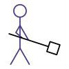

<div class="nav">
  <a href="../index.html">Home</a> | <a href="../gaming-index.html">Gaming</a> | <a href="../fundamentals-index.html">Fundamentals</a>
</div>

## Scala essentials for Kojo gaming

>  <br/> *This section of the website is currently under development*.

Here's the absolute minimum amount of programming theory and Scala information that you need to know - to be able to effectively write games in Kojo.
* [Program Structure](#program-structure)
* [Program Operation](#program-operation)
* [Program Development](#program-development)
* [Scala Facts](#scala-facts)
* [Gaming Primitives](#gaming-primitives)
* [Means of composition in Scala](#means-of-composition-in-scala)
* [An Example](#an-example)
* [Scala Collections](scala-collections.html)
* [How-tos](../howtos/gaming.html)

### Program Structure
* A program is a sequence of lines of text.
* Each line contains instructions for the computer. These instructions can be of the following kinds:
  * Commands - which let you take output actions that can be sensed in the external world (e.g. `forward(100)`, `println(10)`), or indirectly affect future actions (e.g. `setPenColor(blue)`).
  * Expressions - which are portions of your program text that can be evaluated to produce a value. Expressions are of two kinds:
    * Functions - which take input values and compute output or return values from these inputs (e.g. `math.round(11.1)`, `math.pow(2, 3)`).
    * Literals - which evaluate to themselves (e.g. `9`, `7.1`, `blue`, `"hello"`, `List(1, 2, 3)`).
  * Keyword instructions - which have special meaning in Scala, and which let you structure your programs by combining existing instructions (e.g. `val`, `var`, `def`). At the end of the day, keyword instructions behave like commands or expressions.
  * Queries - which let you access (potentially changing) values in the program's environment (e.g. `position`, `heading`, `readInt("Enter a number")`, `random(10`). A query is like a function in that it returns a value, but is different from a function in that it returns a different output value each time it is used with the same input. For the rest of this document, we will (mostly) refer to a query as a function.
* The instructions in your program make use of data values to do their jobs.
* You **use** a command or function in your program by **calling** it with (optional) input data.

### Program Operation
A program is made out of data and code (code refers to the instructions that make up the program). A program's job is to:
1. Start out with some intial data values. These initial data values can be hard-coded inside the program, or can be read from the outside via a query.
2. Compute some new values from its current values - via the use of functions.
3. Show you some outputs based on the new current values - via the use of commands.
4. Optionally go back to step 2 above.

### Program Development
You use three important ideas while writing a program:
* Primitives - these are the commands, functions, and data types provided to you by your programming language/environment. See below for the [gaming primitives](#gaming-primitives) that you will use.
* Composition - these are the ways in which your programming language allows you to combine the primitives to do useful things. The [means of composition](#means-of-composition-in-scala) that you will use for now are given below.
* Abstraction - this is the process of giving names to useful compositions, so that they become available as primitives in your program. The [Scala facts](#scala-facts) section below describes the means of abstraction that you will use.

### Scala Facts
* Every data value is an object. An object combines data with functions/commands. The functions/commands attached to an object are called its methods.
  * Every object has a type.
  * A type determines a set of possible values and the operations that can be done with these values.
  * Some primitive types are - Int, Double, Boolean, String, Color, Sequence, Map, Set, etc.
* Given a value `pic` that has a method `draw()`, you can call the draw method like this: `pic.draw()`.
* The `val` keyword instruction allows you to associate a name with a value; e.g. `val x = 10`. This is a form of abstraction.
* The `var` keyword instruction allows you to bind a name to a value; e.g. `var x = 10`. This name can be bound to a different value later on in your program. This is a form of abstraction.
* The `def` keyword instruction allows you to define a new command or function. This is a means of abstraction.
* The `class` keyword instruction lets you create a new class. A class is a description for a new type of object. The class can contain `vals`, `vars`, and `defs`. This is a powerful means of abstraction.
  * Once you create a class, let's say X, you can create an object of type X (also called a new instace of X) like this: `new X()`.
* The `if-else` keyword lets you check the result of a condition and choose between two alternative code paths based on the result of the condition. This is a means of composition.
  * A condition is an expression that evaluates to a Boolean (true or false).

The [example below](#an-example) will make these ideas concrete.

### Gaming Primitives
* `drawStage(color)` - draws a stage on the canvas with the given color. The stage border can be used for collision detection with game objects to keep them within the canvas.
* `canvasBounds` - returns the bounds of the canvas within an object that has `x`, `y`, `width`, and `height` data values.
* `Picture { turtle drawing }` - creates a picture out of a turtle shape.
  * The turtle shape can be made by using the [turtle primitives](../reference/turtle.html).
* `Picture.image(fileName)` - creates a picture from an image file.
* `pic.draw()` - draws the given picture on the canvas. Just creating a picture does not draw it. The creation via a function and the drawing via a command are separate operations.
* `pic.translate(x, y)` - moves the picture named `pic` on the canvas by the given amount.
* `pic.rotate(angle)` - rotates the picture around its origin by the given angle.
* `pic.rotateAboutPoint(x, y, angle)` - rotates the picture by the given angle around the given (x, y) in the local coordinate system of the picture.
* `pic.setPosition(x, y)` - sets the position of the picture named `pic` to be the given (x, y) on the canvas.
* `pic.collidesWith(otherPic)` - checks to see if `pic` is in collision with `otherPic`.
* `pic.onMouseClick { { (x, y) => code }` - runs the given code when the mouse is clicked on the picture. The code has access to the (x, y) of the mouse click.
* `bouncePicVectorOffStage(pic, vel)` - computes a new velocity for `pic` moving with `velocity` that collides with the stage border.
* `Vector2D(x, y)` - creates a vector with the two given components. The vector specifies a magnitude and a direction.
* `animate { code }` - schedules your code to be called approximately fifty times per second.

The [example below](#an-example) will show you how to use these primitives.


### Means of composition in Scala
For now, you will use the following ideas (which are essentially about composing commands):
* Sequencing - you put instructions one after the other in your program, and these instructions run in sequence, one line after the other, top to bottom.
* Looping - is for the situation where you want a sequence of instructions to run multiple times. For this you can use things like [`repeat`](../reference/turtle.html#repeat) and [`repeatFor`](../reference/turtle.html#repeatfor) from earlier. For animations in gaming, you can use the `animate { code }` command. With `animate`, the code that you give it gets called approximately fifty times per second till you stop the animation.
* Selection - you can use `if-else` to choose between two alternative code paths.

### An Example
Here's a program that brings all of these ideas together:
```scala
clear()
drawStage(ColorMaker.black)
val cb = canvasBounds

class Shape {
    val pic = Picture {
        setFillColor(red)
        repeat(4) {
            forward(40)
            right(90)
        }
    }
    pic.setPosition(cb.x + 20, cb.y + 20)
    var vel = Vector2D(2, 10)
    val gravity = Vector2D(0, -0.2)

    def draw() {
        pic.draw()
    }

    def step() {
        vel = vel + gravity
        pic.translate(vel)
        if (pic.collidesWith(stageBorder)) {
            vel = bouncePicVectorOffStage(pic, vel)
        }
    }
}

val shape = new Shape()
shape.draw()

animate {
    shape.step()
}
```


The above contains a very brief introduction to Scala. For more detailed information, here are some links that you can refer to:
* [Programming in Scala book](https://www.artima.com/pins1ed/)
* [Scala for Java programmers](https://docs.scala-lang.org/tutorials/scala-for-java-programmers.html)
* [A Scala tutorial](https://docs.scala-lang.org/tutorials/)
