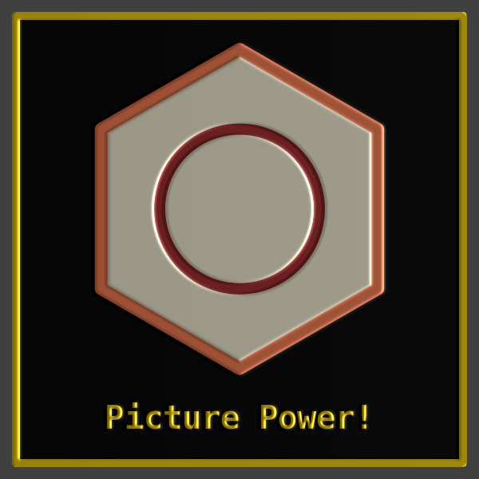

<div class="nav">
  <a href="../index.html">Home</a> | <a href="../turtle-index.html">Turtle Graphics</a>
</div>

## Picture Basics

The basic idea with pictures is simple:
* You put a turtle drawing inside a picture.
* Now you can do many things with this picture drawing:
  * You can draw it (of course).
  * You can align it with other pictures.
  * You can translate, scale, or rotate it.
  * You can apply effects to it.
  * You can change its transparency.
  * You can animate it.
  * You can detect collisions with other pictures.
  

Here, we are only interested in the drawing, alignment, and effect-application apects. Below is some sample code showing this in action:
```scala
// clear the canvas and make the trurtle invisible
cleari()
setBackground(darkGray)

// make the first picture and give it the name pic1
val pic1 = Picture {
    setPenColor(cm.coral)
    setPenThickness(16)
    setFillColor(cm.cornSilk)
    repeat(6) {
        forward(200)
        right(60)
    }
}

// make the second picture and give it the name pic2
val pic2 = Picture {
    setPenColor(cm.brown)
    setPenThickness(14)
    right(360, 100)
}

// make a text picture and give it the name pic3
val pic3 = Picture {
    setPenFont(Font("Monospaced", 40, BoldFont))
    setPenColor(cm.gold)
    write("Picture Power!")
}

// stack pic1 and pic2 on top of each other and center them
val pic12 = picStackCentered(pic1, pic2)

// put pic3, a gap, and the stacked picture in a vertical centered colum
val pic123 = picColCentered(pic3, Picture.vgap(30), pic12)

// make a background
val bg = Picture {
    setPenColor(cm.gold)
    setPenThickness(10)
    setFillColor(black)
    repeat(4) {
        forward(560)
        right(90)
    }
}

// put the background behind what we want to draw
val drawing = picStackCentered(bg, pic123)

// draw the final pic
drawCentered(drawing)
```


### Adding some lighting

Now lets add an effect of a distant light shining on our pic - by removing the last line of our code above and adding the following lines:

```scala
// Apply a lighting effect
val lightFilter = new com.jhlabs.image.LightFilter
lightFilter.getLights.clear()
val light = new lightFilter.DistantLight()
light.setAzimuth(0.toRadians)
light.setElevation(5.toRadians)
lightFilter.addLight(light)

val drawingLit = effect(lightFilter) -> drawing

// draw the final pic
drawCentered(drawingLit)
```

