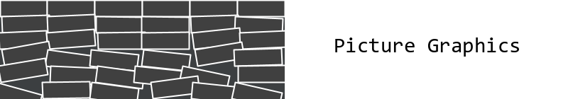
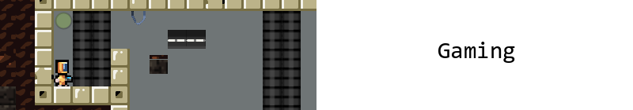

This is the documentation wiki for the [Kojo Learning Environment](http://www.kogics.net/kojo).  
Kojo has four major activity areas, as shown below. Click on an area to view its documentation.
* * *

* * * 

* * * 

* * * 

* * *

  <a href="fundamentals-index.html">Fundamentals</a>  
  <a href="references-index.html">References</a>  
  <a href="contribute.html">Contribute Content</a>  
  All artwork on this site has been done in <a href="http://www.kogics.net/kojo">Kojo</a>

