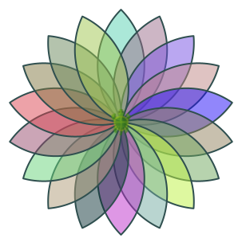
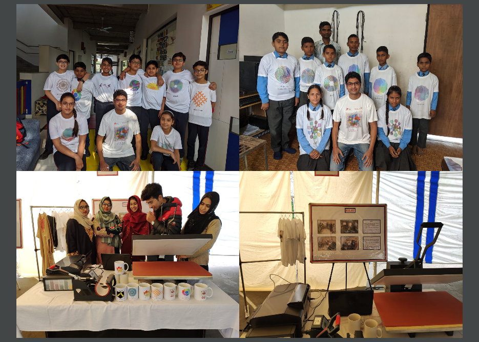
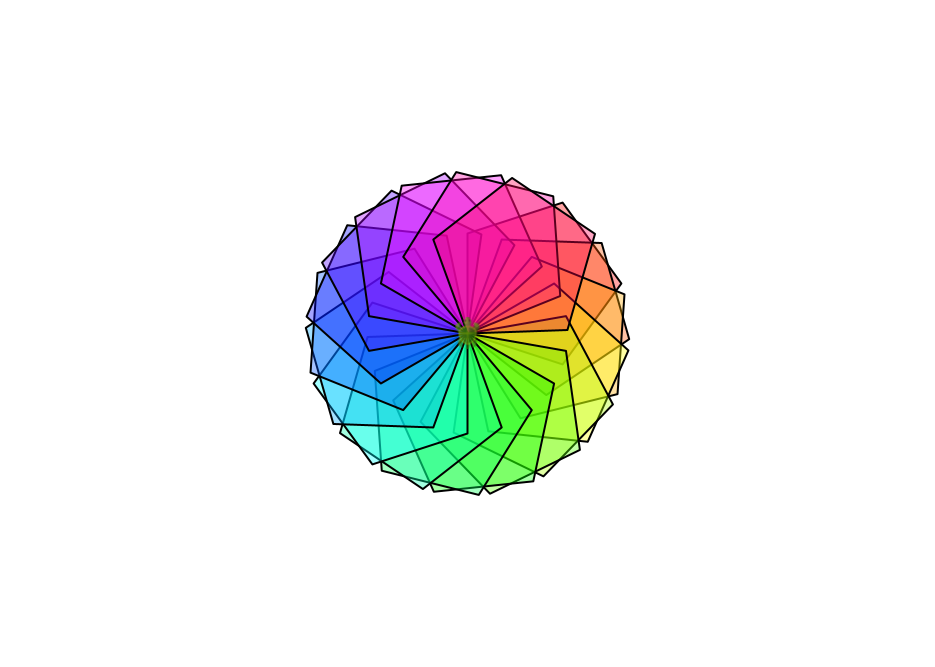
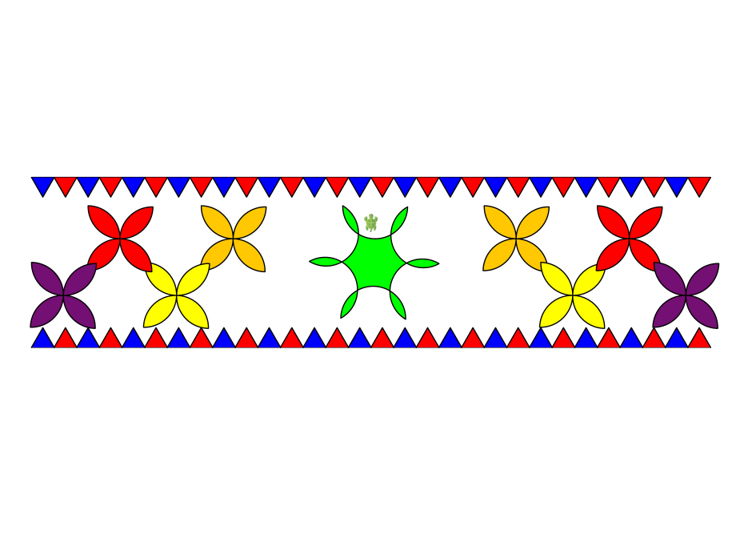
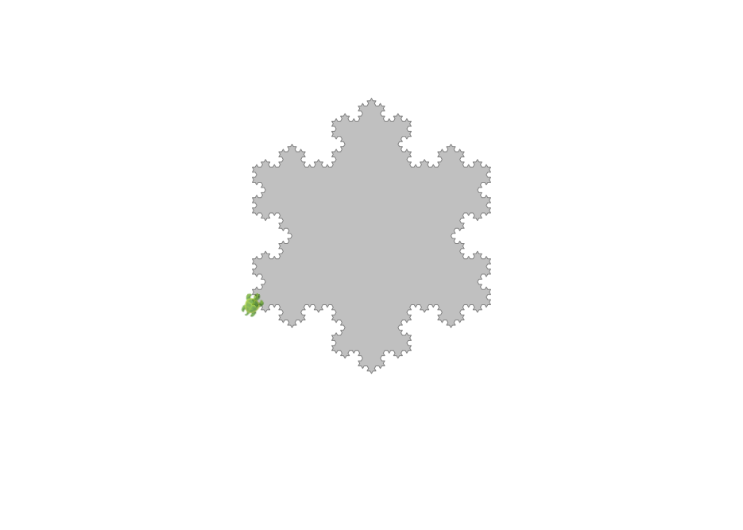
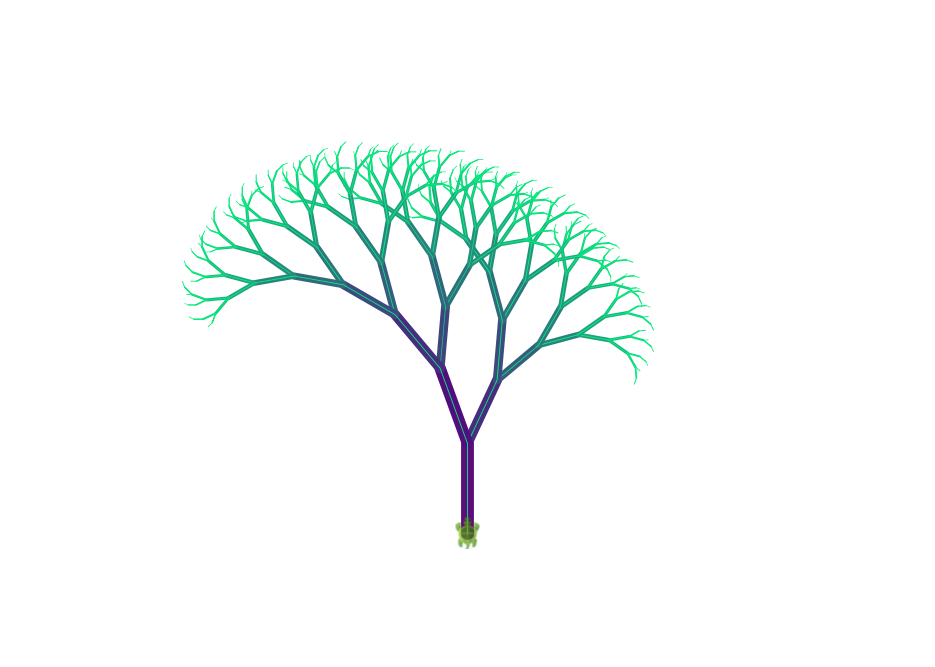
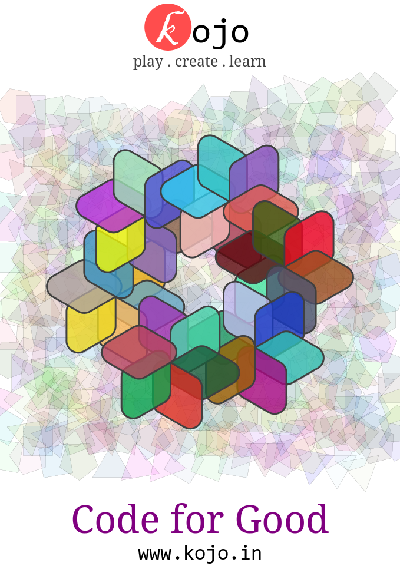

  <a href="/index.html">Home</a> | <a href="modules-index.html">Modules</a>

## Module 1 - Drawings and Generative Art with Turtle Graphics
**Learn to program as you create printable geometric art**  
*Around 25 one-hour classes plus projects*

  

### Topics

Turtle graphics, commands, functions, colors, shapes, pattern analysis and design, control flow.

### Activities

Create a wide range of computational drawings, backdrops, and patterns.

### Benefits

Critical thinking, creative thinking, programming, analysis, design, real-word impact via printable merchandise.

### Achievements

Introductory programming certificate, aesthetic and attractive printable art.

---

### Lesson Plans (for grades 6 and above)

* [Explorations with Kojo, Level-1 [PDF]](https://github.com/litan/kojo/releases/download/ebooks/Kojo-Lessons-Level1-010422.pdf) (Version -- April 1, 2022).
* [Explorations with Kojo, Level-1 Supplement](/tutorials/lessons-level1-sup/index.html).

### Activity books for younger children (for grades 3 and above)

* [Getting started with Kojo [PDF]](https://github.com/litan/kojo/releases/download/ebooks/getting-started-06-08-18.pdf) (Version -- August 6, 2018).
* [Introduction to Programming with Kojo [PDF]](https://github.com/litan/kojo/releases/download/ebooks/intro-to-programming-180918.pdf) (Version -- September 18, 2018).

### Gallery of Kojo generated art and printed merchandise

   
  Various events around printed merchandise
  

   
  A pentagon pattern
  

   
  A rangoli design
  

   
  A fractal snowflake
  

   
  A fractal tree
  

   
  A t-shirt design

