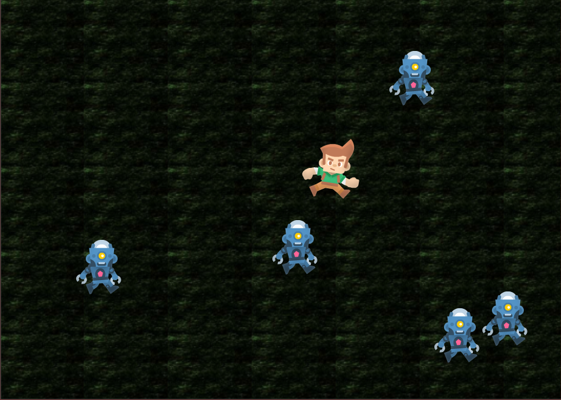

  <a href="/index.html">Home</a> | <a href="modules-index.html">Modules</a>

## Module 2X - Gaming with Picture Graphics
**Go deeper into programming, math, and physics as you create publishable games**  
*Around 25 one-hour classes plus projects*

  

### Topics

Picture graphics, notional machine for programming, object-oriented programming, basic data-structures, animation, collision detection, sprites, sprite-sheets, sounds, web-apps, mobile-apps.

### Activities

Create a wide range of games using geometric shapes, images, and sounds.

### Benefits

Critical thinking, creative thinking, more advanced programming, analysis, design, real-word impact via publishable games.

### Achievements

Intermediate programming certificate, enjoyable publishable games.

---

### Lesson Plans

* [Gaming-1](/tutorials/gaming-1/index.html)

### Gallery of Kojo created games

You can check out [many sample games](/ikojo.html#examples) made with Kojo.
