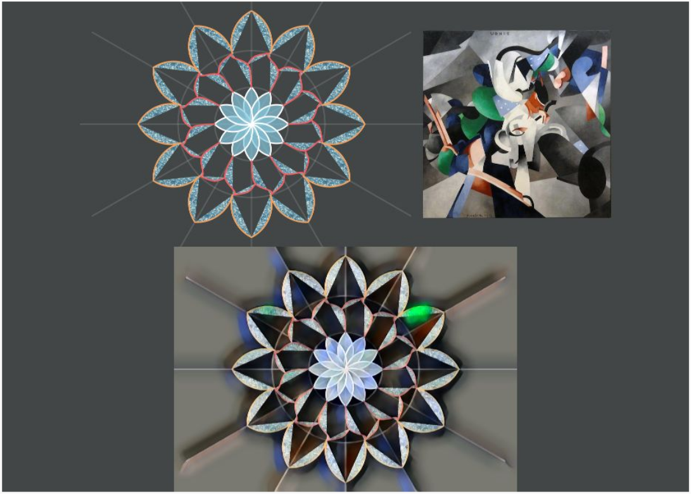

  <a href="/index.html">Home</a> | <a href="modules-index.html">Modules</a>

## Module 3 - Drawings and Generative Art with Picture Graphics
**Create richer generative art using functional graphics, math, and AI**  
*Around 25 one-hour classes plus projects*

  

### Topics

Functional graphics, functional programming, multiple co-ordinate systems, grid based designs, mandala designs, deep-learning AI for style transfer.

### Activities

Create a wide range of generative art using compositional graphics, grids, mandalas, and AI.

### Benefits

Critical thinking, creative thinking, more advanced programming, introduction to deep-learning AI, analysis, design, real-word impact via printable merchandise.

### Achievements

Programming proficiency certificate, rich and intricate printable art.

---

### Lesson Plans

*Coming Soon*

For now, take a look at the following tutorials:
* [An introduction to Pictures](/tutorials/pictures-intro.html).
* [An introduction to grid based generative art](/tutorials/generative-art-grid-intro.html).
* [Grid based generative art (part 2)](/tutorials/generative-art-grid-part2.html) -- Using color and shape palettes.
* [Grid based generative art (part 3)](/tutorials/generative-art-grid-part3.html) -- Using colors from an image.
* [Neural Style Transfer](/tutorials/neural-style.html) -- Using deep-learning/AI to transfer the style of an image to your drawing.

---

The [Picture Graphics Reference](/reference/picture.html) page contains a listing of all the useful Picture commands and functions.

### Gallery of Kojo made generative art

   
  A dynamic grid
  

   
  Another dynamic grid
  

   
  An irregular grid painted with a color palette
  

   
  An irregular grid painted with colors from an image
  

   
  Another irregular grid painted with colors from an image

