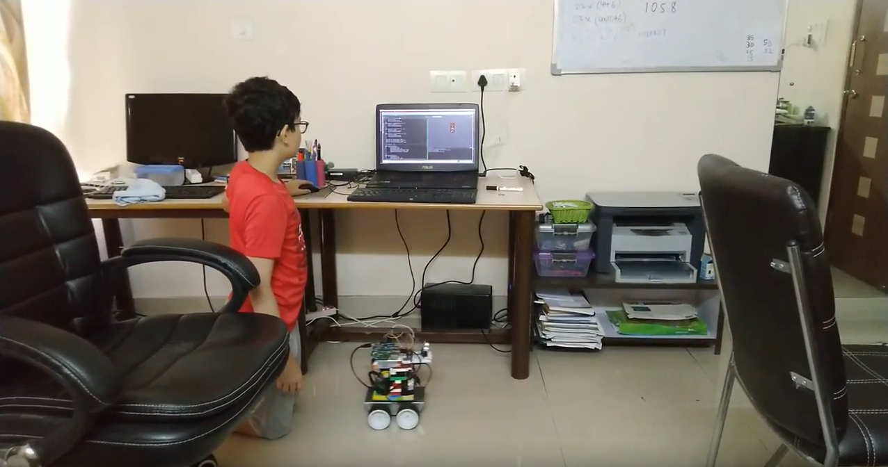

  <a href="/index.html">Home</a> | <a href="modules-index.html">Modules</a>

## Module 5 - Electronic Circuits and Robots
**Use Arduino and Raspberry-PI to build smart circuits and robots**  
*Around 25 one-hour classes plus projects*

  

### Topics

Electronic circuits with the Arduino board. Robots with a combination of Arduino + Raspberry-Pi.

### Activities

Create interesting circuits and simple robots controlled by code that you write. 

### Benefits

Critical thinking, creative thinking, advanced programming, introduction to circuits and robotics.

### Achievements

Advanced programming with circuits and robots certificate, interesting runnable creations in the physical world.

---

### Lesson Plans

*Coming Soon*

For now, here are some links:

* [The Kojo-Arduino Bridge](https://github.com/litan/kojo-arduino).
* [Simple electronics examples](https://github.com/litan/kojo-arduino/tree/master/examples).
* [Some more electronics examples](https://github.com/litan/kojo-arduino/tree/master/starterkit).
* [A video of a Kojo Robot](https://www.youtube.com/watch?v=atNDPTig2_Y&feature=youtu.be) built using [The Kojo-Arduino Bridge](https://github.com/litan/kojo-arduino).
