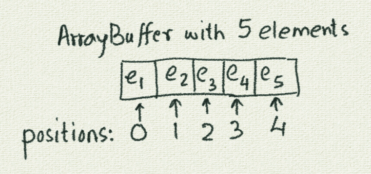
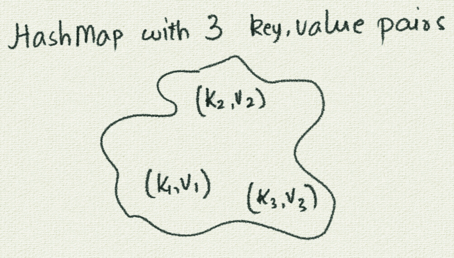

<div class="nav">
  <a href="../index.html">Home</a> | <a href="../gaming-index.html">Gaming</a> | <a href="../references-index.html">References</a>
</div>

>  <br/> *This page is currently under development*.

---

## Quickref - ArrayBuffer, HashMap, and HashSet for gaming

* [1 ArrayBuffer](#arraybuffer)
* [1.1 Creation](#arraybuffer-creation)
* [1.2 Addition of elements at the end](#arraybuffer-addition)
* [1.3 Iteration over all the elements](#arraybuffer-iteration)
* [2 HashMap](#hashmap)
* [2.1 Creation](#hashmap-creation)
* [2.2 Addition of key, value pairs](#hashmap-addition)
* [2.3 Lookup of values based on keys](#hashmap-lookup)

<a name="arraybuffer"/>
**1 ArrayBuffer**

An ArrayBuffer is a sequence of elements. Every element can be located based on its position or index within the ArrayBuffer. 

Positions (or indices) start from `0` and go upto `length - 1`.

Here is a pictorial representation of an ArrayBuffer:



The following are the primary operations that you can do with an ArrayBuffer:

<a name="arraybuffer-creation"/>
**1.1 Creation**
* `ArrayBuffer.empty[type]` - creates an empty ArrayBuffer which will hold elements of the given type.

Example:
```scala
ArrayBuffer.empty[Int]
ArrayBuffer.empty[Picture]
```


* `ArrayBuffer(e1, e2, e3)` - creates an ArrayBuffer with the given elements

Example:
```scala
ArrayBuffer(4, 9, 7)
ArrayBuffer(pic1, pic2, pic3, pic4)
```

<a name="arraybuffer-addition"/>
**1.2 Addition of elements at the end**

* `ab.append(element)` - adds `element` to the end of an ArrayBuffer called `ab`.

Assume that you have created an ArrayBuffer of Ints called `ab1` and and ArrayBuffer of Pictures called `ab2`, and that you have a Picture called `pic5`.

Example:
```scala
ab1.append(7)
ab2.append(pic5)
```

<a name="arraybuffer-iteration"/>
**1.3 Iteration over all the elements**

Iterating over the elements means going over all the elements (to do something with each)
* `repeatFor(ab) { e => /* do whatever with e /* }` - iterators over all the elements of an ArrayBuffre called `ab`. While iterating, the current element is called `e` in the given example. Your code can do whatever it wants with `e`.

Assume that you have created an ArrayBuffer of Ints called `ab1` and and ArrayBuffer of Pictures called `ab2`.

Example:
```scala
repeatFor(ab1) { n =>
    println(n)
}

repeatFor(ab2) { p =>
    draw(p)
}
```

<a name="hashmap"/>
**2 HashMap**

A HashMap is a collection of key-value pairs. You can add key-value pairs to a HashMap, and quickly look up the values for given keys.

Here is a pictorial representation of a HashMap:



The following is a description of the primary operations that you can do with a HashMap:

<a name="hashmap-creation"/>
**2.1 Creation**

* `HashMap.empty[type1, type2]` - creates an empty HashMap which will hold keys of `type1` and values of `type2`.

Example:
```scala
HashMap.empty[String, Int]
HashMap.empty[Picture, Vector2D]
```

<a name="hashmap-addition"/>
**2.2 Addition of key, value pairs**

* `hm.(key) = value` - adds the pair `(key, value)` to a HashMap called `hm`.

Assume that you have created a HashMap of `String to Int` called hm1 and a HashMap of `Pictures to Vector2Ds` called hm2, and that you have Pictures called `pic1`, and `pic2`.

Example:
```scala
hm1("Aditya") = 12
hm1("Ushi") = 12

hm2(pic1) = Vector2D(1, 1)
hm2(pic2) = Vector2D(12, 13)
```

<a name="hashmap-lookup"/>
**2.3 Lookup of values based on keys**

* `hm(key)` - gives you the value that corresponds to the given `key` in a HashMap called `hm`.

Assume that you have created a HashMap of `String to Int` called hm1 and a HashMap of `Pictures to Vector2Ds` called hm2, and that you have Pictures called `pic1`, and `pic2`.

Example:
```scala
println(hm1("Aditya"))
println(hm1("Ushi"))

pic1.translate(hm2(pic1))
pic2.translate(hm2(pic2))
```

<br/>
<br/>
<br/>
<br/>
<br/>
<br/>
<br/>
<br/>
<br/>
<br/>
<br/>
<br/>
<br/>
<br/>
<br/>
<br/>
<br/>
<br/>
<br/>
<br/>
<br/>
