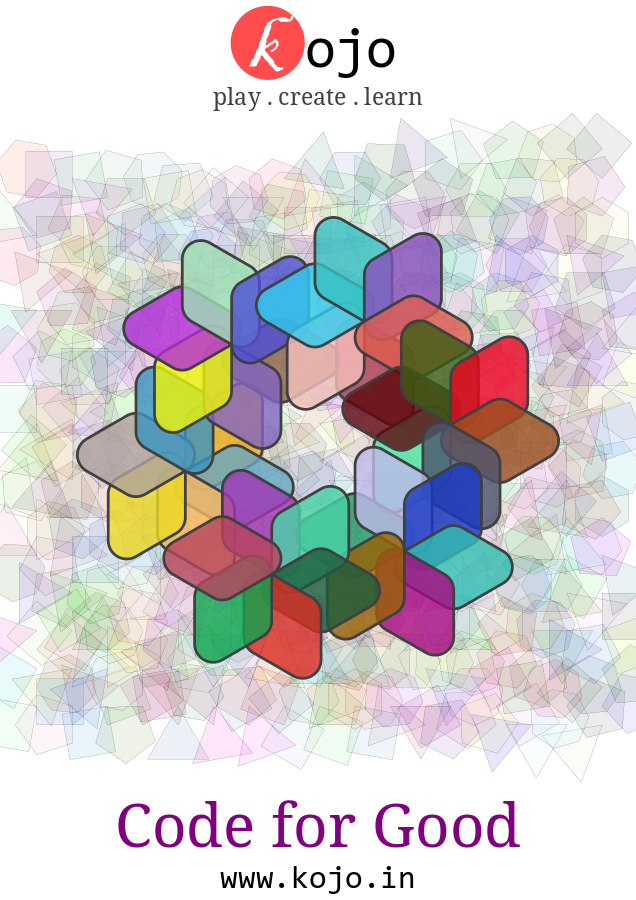

## Kojo Strengths

### A modern programming environment
Kojo has the following features to support the flow of programming:
* Syntax highlighting.
* Code completion.
* Fast interactivity - instant feedback for graphics and console based programming.
* Online help.
* Program data exploration via Worksheet mode or Explorer pane.
* Program tracing.
* Line-by-line program running.
* Searchable program history.
* And more...

### A powerful language
[Scala](http://scala-lang.org), the programming language used in Kojo, has great (arguably better than any other language in the world) support for the most important and widely used programming/computing ideas and paradigms:
* modular programming
* object-oriented programming  
* functional programming
* concurrent programming

Kids learning programming in Kojo get to see these ideas in a theoretically clean but also practically very usable and rich context. These learned ideas can then be transferred very easily to other languages like Python, Javascript, and Java.

### Physical product development opportunities
Kojo has great support for generative art, which can be used to create exciting designs that can be printed on t-shirts, carry bags, posters, back-packs, cups, caps, etc. This enables children to build things that they can use, showcase, and potentially sell. This in turn provides tremendous motivation and multi-dimensional learning and growth opportunities.

Here is a sample t-shirt design done in Kojo:

---

