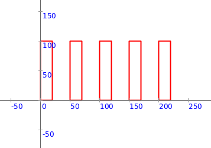

<div class="nav">
  <a href="../index.html">Home</a> | <a href="../references-index.html">References</a>
</div>

To best understand the Scala quick-reference below, it is useful for you to be familiar with the following ideas:
* [Program Structure](../concepts/scala-essentials#program-structure)
* [Program Operation](../concepts/scala-essentials#program-operation)
* [Program Development](../concepts/scala-essentials#program-development)

Click on the links above to review the ideas before moving on.

Also, to complement the contents of this page (and for a good introduction to Scala), make sure you check out the freely available version of [Scala for the Impatient](Scala for the Impatient.pdf) by Cay Horstmann.


## Scala Quick Reference
---

* [1. Data Types](#data)
* [1.1 Int](#data-int)
* [1.2 Double](#data-double)
* [1.3 Boolean](#data-boolean)
* [1.4 String](#data-string)
* [1.5 Color](#data-color)
* [1.6 Picture](#data-picture)

* [1.7 Collections](#data-collections)
* [1.7.1 Sequence (Seq)](#data-sequence)
* [1.7.1.1 Array](#data-array)
* [1.7.1.2 ArrayBuffer](#data-arraybuffer)
* [1.7.1.3 Range](#data-range)
* [1.7.2 Map](#data-map)
* [1.7.2.1 HashMap](#data-hashmap)
* [1.7.3 Set](#data-set)
* [1.7.3.1 HashSet](#data-hashset)
* [1.7.4 Option](#data-option)

---

* [2. Control Flow](#control)
* [2.1 Sequencing](#control-sequencing)
* [2.2 Blocks](#control-blocks)

* [2.3 Loops](#control-loops)
* [2.3.1 repeat](#control-repeat)
* [2.3.2 repeatFor](#control-repeatFor)
* [2.3.3 for](#control-for)

* [2.4 Selection](#control-selection)
* [2.4.1 if-else](#control-if-else)


* [2.5 Calls](#control-calls)

---

* [3 Abstraction / Naming](#abstraction)
* [3.1 val](#abstraction-val)
* [3.2 var](#abstraction-var)
* [3.3 def](#abstraction-def)
* [3.4 class](#abstraction-class)
* [3.5 case class](#abstraction-case-class)

<a name="data">
**1. Data Types**

A program is nothing without data. It starts out with some data values and computes new values from old values as it runs ([as explained elsewhere](../concepts/scala-essentials#program-operation)). So learning about data is important.

Here is some background information for you before you start looking at the different types of data available in Scala:

* A single piece of data is called a value.
* In Scala, every value is an object. 
* An object combines data with functions/commands. The functions/commands attached to an object are called its methods.
* Every object has a type.
* A type determines a set of possible values and the operations that can be done with these values.

Remember - in the context of Scala, the terms *data*, *value*, and *object* mean the same thing.

The following are some of the different types of data supported by Scala.

<a name="data-int">
**1.1 Int**

Ints represent integral data. e.g. `1`, `3`, `5`, `-4`, `-9`.  
The usual math operators/functions (`+`, `-`, `*`, `/`, `>`, `>=`, `<`, `<=`, `==`, `!=`) are supported for Ints.  
Note that some of the above functions return Int values, while others return Boolean values.

Here are some examples of the use of Ints:

```scala
2 + 3 //> res23: Int = 5
3 + (2 * 5) - (10 * 2) //> res24: Int = -7
2 > 10 //> res25: Boolean = false
```
The above code shows some operations on integers after it is run (in Kojo) in *Worksheet* mode via `Shift+Enter`. Each expression in the above code is followed by `//>` and then `name: type = value`, where name is a Kojo assigned name for the value of the expression.

<a name="data-double">
**1.2 Double**

Doubles represent fractional data. e.g. `1.5`, `3.2`, `5.3`, `-4.1`, `-9.8`.  
The usual math operators/functions (`+`, `-`, `*`, `/`, `>`, `>=`, `<`, `<=`, `==`, `!=`) are supported for Doubles.  
Note that some of the above functions return Double values, while others return Boolean values.

Here are some examples of the use of Doubles:

```scala
2.1 + 3.2 //> res40: Double = 5.300000000000001
3.1 + (2.2 * 5.05) - (10 * 2) //> res41: Double = -5.789999999999999
2.1 > 10 //> res42: Boolean = false
```

<a name="data-boolean">
**1.3 Boolean**

Booleans represent true/false data.  
The usual math operators/functions (`&&`, `||`, `==`, `!=`, `!`, `^`) are supported for Booleans.

Here are some examples of the use of Booleans:

```scala
2 > 10 //> res34: Boolean = false
(10 > 2) && (3 > 11) //> res35: Boolean = false
(10 > 2) && (3 > 11) || (4 < 5) //> res36: Boolean = true
// ! is for negation
!true //> res37: Boolean = false
// ^ is for exclusive-or (xor)
true ^ false //> res38: Boolean = true
true ^ true //> res39: Boolean = false
```
Booleans are important because they are used in [conditions](#control-if-else).

<a name="data-string">
**1.4 String**

Strings are used to communicate textual information to/from a program. Examples of strings are: "Hello World", s"Your score is $score".

Here is an examples of the use of Strings to get data into and out of a program:

```scala
val n = readInt("Enter a number")
val n2 = 2 * n
println(s"Twice the number you entered is $n2")
```

<a name="data-color">
**1.5 Color**

Colors are used to represent visual colors in drawings, games, etc. e.g. blue, green, red.

Here is an example of the use of Colors:

```scala
clear()
setPenColor(cm.brown)
setFillColor(cm.yellow)
repeat(4) {
    forward(100)
    right(90)
}
```
[Read more about colors](../concepts/colors.html)

<a name="data-picture">
**1.6 Picture**

Pictures are a Kojo defined data type. Pictures are visual elements that can be translated, scaled, rotated, spatially arranged, etc.

Here's an example of a Picture being operated on by transforms, as one would normally do while drawing:
```scala
def p = Picture {
    repeat(4) {
        forward(30)
        right(90)
    }
}

cleari()
showAxes()
val pic1 = p
val pic2 = trans(100, 0) * rot(45) * scale(2) -> p
draw(pic1, pic2)
```

Here's an example of a Picture being operated on by methods, as one would normally do in a game:
```scala
val pic = Picture {
    repeat(4) {
        forward(30)
        right(90)
    }
}

cleari()
showAxes()
draw(pic)
animate {
    pic.translate(1, 0)
    pic.rotate(1)
    pic.scale(1.001)
}
```

<a name="data-collections">
**1.7 Collections**

A collection lets you organise the data in your program in a particular way (depending on the nature of the collection). Some useful collections are:

<a name="data-sequence">
**1.7.1 Sequence (Seq)**

A sequence is a collection of data values arranged one after the other with a well defined order of elements. e.g. `Seq(1, 5, 3)`.

If you want to arrange some data in your program in a sequence, and the sequence is fixed, you can use `Seq` to construct the sequence.
```scala
val names = Seq("name1", "name2", "name3")
// assume pic1, pic2, pic3 are defined earlier in your program
val pictures = Seq(pic1, pic2, pic3)
```

Once your data is in a sequence, you can do multiple things with the sequence. Three of the most important operations on a sequence are the following:
* Carry out a command/statement with each element of the sequence (via `foreach`).
* Convert the sequence to another sequence using a function that maps each element to a new element (via `map`).
* Get a sub-sequence from the sequence with elements that meet a certain criterion (via `filter`).

Here's some code showing these operations in action:

```scala
cleari()
showAxes()
def p = Picture {
    repeat(4) {
        forward(30)
        right(90)
    }
}
val pic1 = p
val pic2 = trans(50, 0) -> p
val pic3 = trans(100, 0) -> p
val pictures = Seq(pic1, pic2, pic3)

// do something for each element in the sequence
pictures.foreach { p =>
    draw(p)
}

// map a sequence to convert it to another sequence
val pictures2 = pictures.map { p =>
    rot(45) * fillColor(blue) -> p.copy
}

// then do something for each element in the new sequence
pictures2.foreach { p =>
    draw(p)
}

// filter a sequence to get a sub-sequence
val pictures3 = pictures.filter { p =>
    p.position.x > 50
}

// then do something for each element in the new sequence
pictures3.foreach { p =>
    draw(rot(-30) * fillColor(green) -> p.copy)
}
```
Note - you need to do a `p.copy` in the above code because the original picture `p` has already been drawn, and you can't redraw a picture.

Let's try to understand what the following code (copied from above) does. The code uses the `map` function  :
```scala
val pictures2 = pictures.map { p =>
    rot(45) * fillColor(blue) -> p.copy
}
```
This code can be rewritten as:
```scala
def fn1(p: Picture): Picture = {
    rot(45) * fillColor(blue) -> p.copy
}

val pictures2 = pictures.map(fn1)
```
The first version of the code uses an anonymous function that is defined inline in the call to `map`, while the second version of the code uses a named function that is defined earlier and then used in the call to `map`.

Let's do a similar exercise for `filter`.

Here's the version from above with an anonymous function defined inline:

```scala
val pictures3 = pictures.filter { p =>
    p.position.x > 50
}
```

And here is the version with a named function:

```scala
def fn2(p: Picture): Boolean = {
    p.position.x > 50
}

val pictures3 = pictures.filter(fn2)
```
As you can see above, `map` and `filter` both take a function as input, apply that function to each element of the sequence, and construct a new sequence based on the results of the function calls.

Here's one more example of map and filter, this time working with a sequence of integers:
```scala
val s1 = Seq(1, 2, 3) //> s1: Seq[Int] = List(1, 2, 3)
val s2 = s1.map { n =>
    n * 2
} //> s2: Seq[Int] = List(2, 4, 6)

val s3 = Seq(20, 91, 55, 80) //> s3: Seq[Int] = List(20, 91, 55, 80)
val s4 = s3.filter { n =>
    n > 60    
} //> s4: Seq[Int] = List(91, 80)
```

Scala has multiple sequence types (technically subtypes of Seq). Let's look at a few that we will use frequently. 

<a name="data-array">
**1.7.1.1 Array**

An `Array` is useful when you want to be able to modify an existing sequence by changing its elements.

An `Array` is also a sequence, so anything you can do with a sequence (including the stuff from the previous section), you can also do with an `Array`.

Here is some sample code for `Arrays`.

```scala
// a pre-populated array
val a1 = Array(1, 2, 3) //> a1: Array[Int] = Array(1, 2, 3)

// array element access
a1(1) //> res59: Int = 2

// an empty array that can be filled up later
val a2 = Array.ofDim[Int](3) //> a2: Array[Int] = Array(0, 0, 0)

// array element update
a2(0) = 1
a2(1) = 2
a2(2) = 3

a1 //> res63: Array[Int] = Array(1, 2, 3)
a2 //> res64: Array[Int] = Array(1, 2, 3)

// an empty 2D array (aka - array of arrays)
val a3 = Array.ofDim[Int](2, 3) //> a3: Array[Array[Int]] = Array(Array(0, 0, 0), Array(0, 0, 0))

// array element update
a3(0)(0) = 1
a3(1)(1) = 2
a3(1)(2) = 3
a3 //> res68: Array[Array[Int]] = Array(Array(1, 0, 0), Array(0, 2, 3))

// array element access
a3(1)(1) //> res69: Int = 2
a3(1) //> res70: Array[Int] = Array(0, 2, 3)
```


<a name="data-arraybuffer">
**1.7.1.2 ArrayBuffer**

An `ArrayBuffer` is useful when you want to be able to modify an existing sequence by changing its elements, adding new elements to it, or removing elements from it.

An `ArrayBuffer` is also a sequence, so as with `Arrays`, anything that you can do with a sequence you can also do with an `ArrayBuffer`.

Here is some sample code for `ArrayBuffers`.

```scala
// a pre-populated arraybuffer
val ab = ArrayBuffer(1, 5, 3, 9) //> ab: scala.collection.mutable.ArrayBuffer[Int] = ArrayBuffer(1, 5, 3, 9)

// element removal
ab.remove(0) //> res48: Int = 1
ab //> res49: scala.collection.mutable.ArrayBuffer[Int] = ArrayBuffer(5, 3, 9)

// element update
ab(1) = 12
ab //> res51: scala.collection.mutable.ArrayBuffer[Int] = ArrayBuffer(5, 12, 9)

// element addition
ab.append(21)
ab //> res53: scala.collection.mutable.ArrayBuffer[Int] = ArrayBuffer(5, 12, 9, 21)

// an empty arraybuffer
val ab2 = ArrayBuffer.empty[Int] //> ab2: scala.collection.mutable.ArrayBuffer[Int] = ArrayBuffer()

// element addition
ab2.append(11)
ab2.append(2)
ab2 //> res56: scala.collection.mutable.ArrayBuffer[Int] = ArrayBuffer(11, 2)

// element update
ab(0) = 21
ab //> res58: scala.collection.mutable.ArrayBuffer[Int] = ArrayBuffer(21, 12, 9, 21)
```

<a name="data-range">
**1.7.1.3 Range**

A range is an ordered sequence of integers that are equally spaced apart. Examples:
```scala
1 to 5
0 to 10 by 2
2 until 6
1 until 11 by 3
```

Ranges are very useful in a couple of different situations.

Firstly, as counters for loops:

```scala
repeatFor(1 to 5) { n =>
    println(n, n * n)
}
```

Secondly, to populate data structures:
```scala
(1 until 11 by 3).toBuffer //> res4: scala.collection.mutable.Buffer[Int] = ArrayBuffer(1, 4, 7, 10)
```

```scala
cleari()
val pics = (1 to 5).map { n =>
    val pic = Picture.rectangle(30, 20 * n)
    pic.setPosition(n * 40, 0)
    pic
}

repeatFor(pics) { p =>
    draw(p)
}
```

<a name="data-map">
**1.7.2 Map**

A map allows you to associate a key with a value. 

Once a `(key, value)` is in a map `m`, it can be looked up via `m(key)`, `m.get(key)`, or `m.getOrElse(key, notFoundValue)`.

Here's an example:
```scala
clearOutput()
val mymap = Map(
    "key1" -> "value1",
    "key2" -> "value2",
    "key3" -> "value3",
) //> mymap: scala.collection.immutable.Map[String,String] = Map(key1 -> value1, key2 -> value2, key3 -> value3)

mymap("key1") //> res1: String = value1
mymap.get("key1") //> res2: Option[String] = Some(value1)
mymap.get("key5") //> res3: Option[String] = None
mymap.getOrElse("key5", "Not found") //> res4: String = Not found
```

Here's another example:

```scala
clearOutput()
val ageBook = Map(
    "Rahul" -> 10,
    "Avinash" -> 12,
    "Manya" -> 11
)

val name = readln("Whose age do you want to know?")
// this will throw an exception if the name is not in the map. We don't care here.
val age = ageBook(name)
println(s"${name}'s age is $age")
```

<a name="data-hashmap">
**1.7.2.1 HashMap**

If you need to to be able to update a map after it is defined, use a HashMap:

```scala
cleari()
drawStage(black)
val pic1 = fillColor(red) -> Picture.rectangle(40, 40)
val pic2 = fillColor(red) -> Picture.circle(20)
draw(pic1, pic2)

val vels = HashMap(
    pic1 -> Vector2D(3, 2),
    pic2 -> Vector2D(-2, 3)
)

val pics = Seq(pic1, pic2)

animate {
    pics.foreach { pic =>
        val picVel = vels(pic)
        pic.translate(picVel)
        if (pic.collidesWith(stageBorder)) {
            val newPicVel = bouncePicVectorOffStage(pic, picVel)
            vels(pic) = newPicVel
        }
    }
}
```

<a name="data-set">
**1.7.3 Set**

A set, like a sequence, is a collection with multiple elements. A set is different from a sequence in the following respects:
* The elements are not in any particular order.
* There can be no duplicate elements.

A set supports operations similar to sequences - including `foreach`, `map`, and `filter`. Sets also support set specific operations like `contains`, `union`, `intersection`, and `difference`.

```scala
val s1 = Set(1, 2, 3, 4) //> s1: scala.collection.immutable.Set[Int] = Set(1, 2, 3, 4)
val s2 = Set(3, 4, 5, 6) //> s2: scala.collection.immutable.Set[Int] = Set(3, 4, 5, 6)
s1.intersect(s2) //> res5: scala.collection.immutable.Set[Int] = Set(3, 4)
```

<a name="data-hashset">
**1.7.3.1 HashSet**

If you need to to be able to update a set after it is defined, use a HashSet:

```scala
cleari()
drawStage(black)
val cb = canvasBounds

def newBullet = {
    fillColor(red) -> Picture.rectangle(2, 5)
}

val bullets = HashSet.empty[Picture]

timer(1000) {
    val b = newBullet
    bullets.add(b)
    draw(b)
    b.setPosition(cb.x + 20, cb.y + 5)
    b.setHeading(- random(45))
}


animate {
    bullets.foreach { b =>
        b.translate(0, 5)
    }

    bullets.foreach { b =>
        if (b.collidesWith(stageBorder)) {
            bullets.remove(b)
            b.erase()
        }
    }
}
```

<a name="data-option">
**1.7.4 Option**

An option is used where a value may or may not be present. For example, given a sequence of numbers, you might want to do a search for the first number in the sequence that is greater than 100. Such a number may or may not be present in the sequence. Let's see this in action in code:

```scala
val nums = Seq(90, 11, 21, 47)
val nums2 = Seq(90, 11, 121, 147)

def findFirstMoreThan(s: Seq[Int], n: Int): Option[Int] =
    s.find { e =>
        e > n
    }

def printAnswer(a: Option[Int]) {
    if (a.isDefined) {
        println(a.get)
    }
    else {
        println("No number found")
    }
}

val ans = findFirstMoreThan(nums, 100)
val ans2 = findFirstMoreThan(nums2, 100)

printAnswer(ans)
printAnswer(ans2)
```

The above code will print:
```
No number found
121
```

If an option has the value `v` inside, it is represented as `Some(v)`. If it has no value inside, it is represented as `None`.


<a name="control">
**2 Control Flow**

As a program runs, [it computes new data from old data and shows this new data to the user](../concepts/scala-essentials#program-operation) as required - with the help of the functions and commands available to it. How these functions and commands are strung together in the program is the subject matter of control flow.

At a high level:

* When a program runs, it carries out the instructions inside it one after the other, in sequence.
* The following constructs change the above default mode of execution:
  * Loops (repeat, repeatFor, for, while, etc) let you do the same thing multiple times.
  * Selection (if-else or switch) let you do different things under different conditions.
  * Calls (to functions or commands) let you make use of abstractions.


Let's look at the above in a little more detail.

<a name="control-sequencing">
**2.1 Sequencing**

This is the default mode of execution of a program - instructions are run one after the other. Here is an example:

```scala
clear()
forward(100)
right(90)
val x = 200
forward(x)
```

<a name="control-blocks">
**2.2 Blocks**

A block is a chunk of code. It can be used in looping (to specify what to do multiple times) or selection (to specify the alternative code paths) or while defining a new function or command (as the body of the function or command). So it is important for you to learn about blocks before you move any further.

A block is any code between `{` and `}`. In Scala, a block has the following important functions:

* Wherever a single expression (or statement) is expected, you can put in multiple sequential statements (or expressions) by enclosing them within a block. The value of this block is the value of the last expression in the block. Recall that statements are expressions that evaluate to `()`.

```scala
val x = {
    val a = 10
    val b = a * 3
    b + 2
}
println(x)
```
This prints
```scala
32
```

* A block introduces a new scope for [naming](#abstraction). A name introduced within a block is visible only within that block, and shadows names from enclosing scopes.

```scala
val x = 10

{
    val x = 20
    println(x)
}

println(x)
```
This prints
```scala
20
10
```

<a name="control-loops">
**2.3 Loops**

A loop takes some code, and runs it over and over again. There are many kinds of loops. Let's look at a few.

<a name="control-repeat">
**2.3.1 repeat**

`repeat(n) { code }` - repeats the given code n number of times. This helps you to do the same thing over and over again.
```scala
clear()
repeat(4) {
    forward(100)
    right(90)
}
```

<a name="control-repeatFor">
**2.3.2 repeatFor**

`repeatFor(sequence) { element => code }` - repeats the given code multiple times, once for each element of the given sequence. The current sequence element is available to your code - to help you do something slightly different based on the current element.
```scala
clear()
setSpeed(fast)
repeatFor(10 to 100) { n =>
    // n is the current element of the sequence that you are going through
    forward(n)
    right(91)
}
```

Now let's look at a particular problem and multiple ways of solving the problem (to give you deeper insights into ideas related to loops). Let's say we want to draw five rectangles (width = 20, height = 100) as shown below:



In the first way of solving the problem, we use `repeatFor` to create and draw the pictures:

```scala
cleari()
repeatFor(0 to 4) { n =>
    val pic = Picture.rectangle(20, 100)
    pic.setPosition(n * 50, 0)
    draw(pic)
}
```

In the second way of solving the problem, we use `repeatFor` to create the desired pictures and add them to an `ArrayBuffer`. Then we just draw all the pictures in the `ArrayBuffer`.

```scala
cleari()
val pics = ArrayBuffer.empty[Picture]
repeatFor(0 to 4) { n =>
    val pic = Picture.rectangle(20, 100)
    pic.setPosition(n * 50, 0)
    pics.append(pic)
}
draw(pics)
```

The third way of solving the problem is very similar to the second one above. We just use `foreach` instead of `repeatFor`.

```scala
cleari()
val pics = ArrayBuffer.empty[Picture]
(0 to 4).foreach { n =>
    val pic = Picture.rectangle(20, 100)
    pic.setPosition(n * 50, 0)
    pics.append(pic)
}
draw(pics)
```
The idea to take away from the second and third solutions is that `repeatFor` and `foreach` are totally interchangable. Where you can use one, you can use the other. Take your pick.

The fourth and last way of solving the problem uses `map` and is arguable the best, because you have a nice separation of functions and commands.

```scala
cleari()
val pics = (0 to 4).map { n =>
    val pic = Picture.rectangle(20, 100)
    pic.setPosition(n * 50, 0)
    pic
}
draw(pics)
```

The third (using `foreach`) and fourth (using `map`) examples above are related to `for` loops, which are the topic of the next section.

<a name="control-for">
**2.3.3 for**

The `for` loop in Scala is extremely powerful, and allows you to use a combination of `foreach`, `map`, and `filter` as per your needs. Let's write the `foreach` and `map` examples from above using `for`:

Here's the `foreach` version:

```scala
cleari()
val pics = ArrayBuffer.empty[Picture]
(0 to 4).foreach { n =>
    val pic = Picture.rectangle(20, 100)
    pic.setPosition(n * 50, 0)
    pics.append(pic)
}
draw(pics)
```

And here's the rewritten `for` version:

```scala
cleari()
val pics = ArrayBuffer.empty[Picture]
for (n <- 0 to 4) {
    val pic = Picture.rectangle(20, 100)
    pic.setPosition(n * 50, 0)
    pics.append(pic)
}
draw(pics)
```

Here's the `map` version:

```scala
cleari()
val pics = (0 to 4).map { n =>
    val pic = Picture.rectangle(20, 100)
    pic.setPosition(n * 50, 0)
    pic
}
draw(pics)
```

And here's the rewritten `for` version:

```scala
cleari()
val pics = for(n <- 0 to 4) yield {
    val pic = Picture.rectangle(20, 100)
    pic.setPosition(n * 50, 0)
    pic
}
draw(pics)
```

Note that `repeat` and `repeatFor` are looping methods provided by Kojo, while `for` is built into Scala itself.  Scala also supports other standard looping methods like - `while`, and `do-while`, but we will not discuss them here.


<a name="control-selection">
**2.4 Selection**

Selection involves chosing from amongst multiple paths of execution for carrying out commands or evaluating expressions.

<a name="control-if-else">
**2.4.1 if-else**

`if (condition) path1 else path2`
* if the condition is true, `path1` is taken, else `path2` is taken.
* `path1` and `path2` can have multiple statements/expressions enclosed in a block.
* the whole `if expression` evaluates to `path1` or `path2`.

Let's see a couple of examples:

Command oriented example (where the paths evaluate to `()`):
```scala
def square(n: Int) {
    if (n > 100) {
        setPenColor(yellow)
        setFillColor(brown)
    }
    else {
        setPenColor(brown)
        setFillColor(yellow)
    }

    repeat(4) {
        forward(n)
        right(90)
    }
}
```

Expression oriented example:
```scala
def absolute(n: Int) = {
    if (n < 0) -n else n
}
```

For effective use of `if-else`, it's important to understand conditions, because it is a condition that determines which path in an `if-else` is taken.

A condition is any function that returns a Boolean. Some examples of such functions are:
* `>`, `>=`, `<`, `<=`, `==`, `!=` for numeric values.
* Any function that you write that returns a Boolean.
* The Boolean binary operators - `&&`, `||`, `==`, and `!=` - which take two Booleans and return a Boolean. These let you combine Booleans in your `if (condition)`.
* The Boolean binary operators - `!` and `^` - which take a Boolean and return a Boolean.

Here's another example:

```scala
val n1 = 10
val n2 = 20
val n3 = 30

def largeNumber(n: Int): Boolean = n > 100

if ((n1 > 15) && (n2 < n1)) {
    println("Condition 1")
}
else if (((n3 > n1) && (n2 > 17)) || (n1 > 25)) {
    println("Condition 2")
}
else if (largeNumber(n2)) {
    println("Condition 3")
}
else {
    println("No match")
}
```


<a name="control-calls">
**2.5 Calls**

A call makes your program jump to a new location, do what is defined there, and then come back and carry on from where it jumped off.

If the call is to a command, a `()` is returned to the caller, and can be safely ignored (because it contains no information).

If the call is to a function, the output value of the function is returned to the caller. The caller then needs to figure out how to use this value later on in the program. One way to do this is to store the return value in a `val`.

Example of calls to a command:

```scala
def square() {
    repeat(4) {
        forward(100)
        right(90)
    }
}

clear()
square()
right(45)
square()
```

Example of a call to a function:
```scala
clear()
def diag(b: Double, h: Double) =
    math.sqrt(b * b + h * h)

forward(100)
right(90)
forward(50)
towards(0, 0)
val d = diag(50, 100)
forward(d)
```

<a name="abstraction">
**3 Abstraction / Naming**

As you write programs, abstraction (along with primitives and composition) is a core idea [as described here](../concepts/scala-essentials#program-development). Abstraction lets you give names to useful things in your program that you need to use multiple times (or even once, if that makes your program clearer to read and understand).

Scala provides the following means of abstraction. Each of these uses a keyword instruction (or statement):

<a name="abstraction-val">
**3.1 val**

The val keyword instruction allows you to associate a name with a value.

`val name1 = value1` - associates name1 with value1. The right hand side is an expression, while the left hand side contains the name to be associated with the value of the expression.

```scala
val x = 10
val y = "Hi there"
```

<a name="abstraction-var">
**3.2 var**

The var keyword instruction allows you to bind a name to a value. This name can be bound to a different value later on in your program.

`var name2 = value2` - binds name2 to value2. The right hand side is an expression, while the left hand side contains the name to be bound to the value of the expression.

```scala
var cnt = 0
while (cnt < 10) {
    println(cnt, cnt * cnt)
    cnt += 1
}
```

<a name="abstraction-def">
**3.3 def**

The def keyword instruction allows you to define a new command or function.

`def newCommand(inputs) { code }` - creates a new command that takes the specified inputs and carries out the commands specified in the given code block.

The `inputs` can be zero or more `name: type` pairs (separated by commas in the case of more than one input), where `name` is the name of an input and `type` is its type.

Here's an example of the definition and usage of some new commands:

```scala
def square1() {
    repeat(4) {
        forward(100)
        right(90)
    }
}

def square2(size: Int) {
    repeat(4) {
        forward(size)
        right(90)
    }
}

def rectangle(h: Int, w: Int) {
    repeat(2) {
        forward(h)
        right(90)
        forward(w)
        right(90)
    }
}

clear()
setSpeed(fast)
square1()
square2(50)
square2(25)
rectangle(200, 75)
```

`def newFunction(inputs) = { code }` - creates a new function that takes the specified inputs, carries out the statements specified in the given code block, and returns the value of the last expression in the code block.

The `inputs` can be zero or more `name: type` pairs (separated by commas in the case of more than one input), where `name` is the name of an input and `type` is its type.

Here's an example of the definition and usage of some new functions:

```scala
def double(n: Int) = n * 2 
def someLongCalculation(n1: Int, n2: Int) = {
    val t1 = n1 * n2
    val t2 = math.sqrt(t1)
    t2 / 2
} 

double(4) //> res4: Int = 8
someLongCalculation(10, 20) //> res5: Double = 7.0710678118654755
```

<a name="abstraction-class">
**3.4 class**

The `class` keyword instruction lets you create a new class. A class is a description for a new type of object. The class can contain `vals`, `vars`, and `defs`. 

The basic idea behind a class is to bring together related data and behavior in your program to create a useful abstraction. You want to do this if it makes your program easier to write and read. Once you have a good abstraction, the rest of your program can use it to good effect without worrying about how it is implemented. In the best case, your program becomes a choreography of the abstractions available within it.

* Once you create a class, let’s say `X`, you can create an object of type `X` (also called an instace of `X`) like this: `new X()`, or `new X(inputs)`.

Here's an example:

```scala
clear()
drawStage(ColorMaker.black)

class BouncingRect(x: Int, y: Int) {
    val pic = Picture.rectangle(40, 40)
    pic.setFillColor(red)
    pic.setPosition(x, y)
    var vel = Vector2D(2, 10)
    val gravity = Vector2D(0, -0.2)

    def draw() {
        pic.draw()
    }

    def step() {
        vel = vel + gravity
        pic.translate(vel)
        if (pic.collidesWith(stageBorder)) {
            vel = bouncePicVectorOffStage(pic, vel)
        }
    }
}

val br = new BouncingRect(-100, -100)
br.draw()

animate {
    br.step()
}
```

<a name="abstraction-case-class">
**3.5 case class**

A case class is a convenient way to get a bunch of data values together to represent something useful in your program.

`case class Name(valueNamesAndTypes)` - defines a case class called Name with the given values of the given types.

The `valueNamesAndTypes` are (usually) two or more `name: type` pairs separated by commas.

A new instance of the class can be created like this: `Name(values)`, where values is a comma separated list of the right number of appropriately typed values. Note that a `new` is not required to create an instance of a case class. This makes case classes as convenient to use as in-built data types.

Here's a quick example:

```scala
case class Person(firstName: String, lastName: String, age: Int)

val p1 = Person("Rahul", "Agarwal", 21)
val p2 = Person("Sanjay", "Pandey", 35)
```

And here's a longer example:

```scala
// Based on ideas from https://generativeartistry.com/tutorials/tiled-lines/
cleari()
setBackground(cm.rgb(60, 63, 65))
val cb = canvasBounds
val n = 20
val deltax = cb.width / n
val deltay = cb.height / n

case class Line(x: Double, y: Double, w: Double, h: Double)

def makeLine(x: Double, y: Double, w: Double, h: Double) = {
    val leftToRight = randomBoolean
    if (leftToRight) Line(x, y, w, h) else Line(x, y + h, w, -h)
}

// construct the drawing data-structure in memory
val lines = ArrayBuffer.empty[Line]
repeatFor(0 until n) { nx =>
    val x = cb.x + nx * deltax
    repeatFor(0 until n) { ny =>
        val y = cb.y + ny * deltay
        lines.append(makeLine(x, y, deltax, deltay))
    }
}

// draw the data-structure out
repeatFor(lines) { l =>
    val pic = Picture.line(l.w, l.h)
    pic.setPosition(l.x, l.y)
    pic.setPenThickness(2)
    pic.setPenColor(white)
    draw(pic)
}
```
