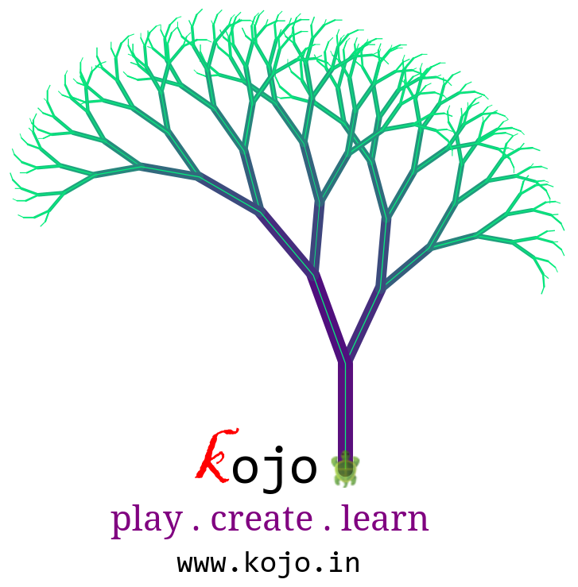

  <a href="index.html">Home</a>

These pages describe the Turtle Graphics facility within Kojo.

* [Getting Started](#getting-started)
* [Turtle Graphics Reference](reference/turtle.html)
* [Core Concepts](concepts/turtle-core-ideas.html)
* [Art Ideas](art/ideas.html)
* [Colors](concepts/colors.html)
* [Picture Basics](#picture-basics)

## Getting Started
To get going with Kojo, use the [Getting Started](http://wiki.kogics.net/kojo-codeactive-books#getting-started) book.
This book will help you learn:
* the basic turtle graphics commands available in Kojo.
* how to write programs using these commands - to draw on the canvas.
* how to make geometric patterns.
* how to analyze given geometric patterns, and to recreate these patterns in a structured way - via programs that you write.

## Turtle Graphics Reference
As you go through the Getting Started book, it's useful to be able to see all the [basic turtle commands](reference/turtle.html) in one place.

## Core Concepts
It's also useful to be able to see all the [core concepts](concepts/turtle-core-ideas.html) in one place.

## Art Ideas
To spice things up as you go along, [here are a bunch of art ideas](art/ideas.html).

## Colors
What's art without colors? Kojo has great support for colors, and it's good for you [to know the details](concepts/colors.html).

## Picture Basics
Pictures build upon turtle graphics to let you create more intricate art, learn deeper ideas in programming and computer science, and also build animations and games. For now, it's good for you to [learn enough about Pictures](concepts/turtle-picture-basics.html) to help you import and align multiple turtle drawings into one composition.

   
   
   
  
   
   
  The fractal tree above was made in Kojo

