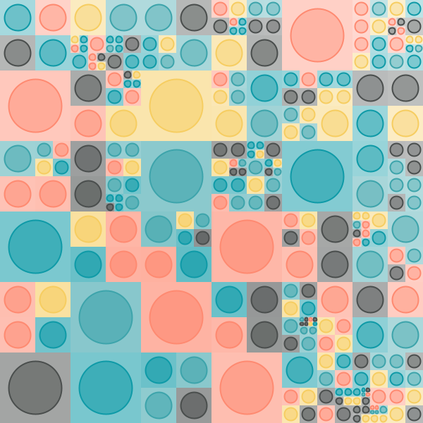
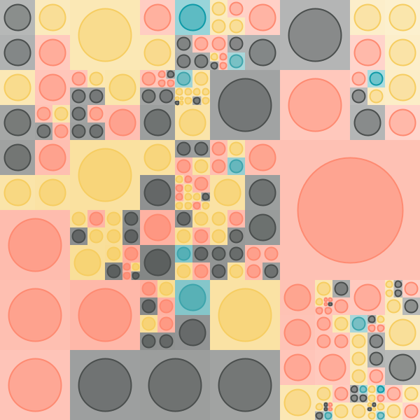
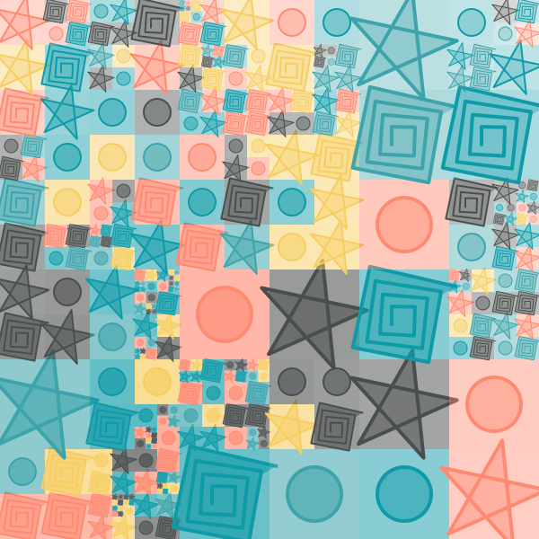

<div class="nav">
  <a href="../index.html">Home</a> | <a href="../picture-index.html">Picture Graphics</a> | <a href="../tutorials-index.html">Tutorials</a>
</div>

## Grid based generative art - Part 2

As mentioned in the [previous tutorial](./generative-art-grid-intro.html), here we will look at:
* Selecting colors for the grid cells based on a harmonious palette (instead of using random colors).
* Using a pool of shapes to populate the cells of the grid (instead of using one shape).

The first step is to take the take the irregular grid program with circles from the previous tutorial and to replace all calls to `randomColor` in it with calls to `cellColor` (a function that you will define). For now `cellColor` will just return a random color:

```scala
size(600, 600)
cleari()
setBackground(white)
originBottomLeft()

val tileCount = 3
val tileWidth = cwidth / tileCount
val tileHeight = cheight / tileCount

def cellColor = randomColor

def shape(w: Double, h: Double) = {
    val len = math.min(w, h) * 3 / 4
    picStackCentered(noPen -> Picture.rectangle(w, h), Picture.ellipseInRect(len, len))
}

case class Block(x: Double, y: Double, w: Double, h: Double, c: Color)
var blocks = ArrayBuffer.empty[Block]

def drawBlock(b: Block) {
    val pic = shape(b.w, b.h)
    pic.setPosition(b.x, b.y)
    val d = mathx.distance(b.x, b.y, mouseX, mouseY)
    val f = mathx.map(d, 0, 800, 0.3, .9)
    val angle = mathx.angle(b.x, b.y, mouseX, mouseY)
    pic.setPenColor(b.c)
    pic.setFillColor(b.c.fadeOut(f))
    pic.setPenThickness(2)
    draw(pic)
}

def splitSomeBlocks(blocks: ArrayBuffer[Block], p: Double): ArrayBuffer[Block] = {
    val blocks2 = ArrayBuffer.empty[Block]
    repeatFor(blocks) { b =>
        if (randomDouble(1) < p) {
            val newBlocks = Array(
                Block(b.x, b.y, b.w / 2, b.h / 2, cellColor),
                Block(b.x, b.y + b.h / 2, b.w / 2, b.h / 2, cellColor),
                Block(b.x + b.w / 2, b.y, b.w / 2, b.h / 2, cellColor),
                Block(b.x + b.w / 2, b.y + b.h / 2, b.w / 2, b.h / 2, cellColor)
            )
            blocks2.appendAll(newBlocks)
        }
        else {
            blocks2.append(b)
        }
    }
    blocks2
}

setup {
    repeatFor(rangeTill(0, cheight, tileHeight)) { posY =>
        repeatFor(rangeTill(0, cwidth, tileWidth)) { posX =>
            val block = Block(posX, posY, tileWidth, tileHeight, cellColor)
            blocks.append(block)
        }
    }
    repeat(5) {
        blocks = splitSomeBlocks(blocks, 0.3)
    }
}

drawLoop {
    erasePictures()
    repeatFor(blocks) { b =>
        drawBlock(b)
    }
}
```

With this in place, you can start playing with `cellColor`. The first step is to choose the `cellColor` from a given `palette` of colors:

---

```scala
// a palettle is a sequence of hexadecimal integer codes for colors, which we map them to color values using the cm.hex function.
val palette = Seq(0x4a4e4d, 0x0e9aa7, 0x3da4ab, 0xf6cd61, 0xfe8a71).map(cm.hex(_))
def cellColor = randomFrom(palette)
```



---

As you can see above, a `palette` is defined as a sequence of colors, and we randomly select from this sequence to choose a color for any given cell in the grid.

There are many web based sources out there to help you come up with good palettes. Here are a few:
* [colorhunt.co](https://colorhunt.co/palettes/popular)
* [coolers.co](https://coolors.co/)
* [color-hex](https://www.color-hex.com/color-palettes/)
* [36 beautiful palettes](https://digitalsynopsis.com/design/beautiful-color-palettes-combinations-schemes/)

The idea with using the above sources is to select a palette, note down the hex codes of the colors in the palettes, and then put them in the `palette` sequece in your code (replace the `#` in the web code of the color with `0x` in the hex-value of the color in your code).

The next thing you can do is to give different weights to the different colors in a palette. Let's look at the palette used above:


Let's say you want more of the first, fourth, and fifth colors in the palette, and very little of the second and third colors. You can do this by using a weight sequence of `Seq(10.0, 1, 1, 10, 10)`. This gives ten times more weightage to the first, fourth, and fifth colors:

---

```scala
val palette = Seq(0x4a4e4d, 0x0e9aa7, 0x3da4ab, 0xf6cd61, 0xfe8a71).map(cm.hex(_))
val weights = Seq(10.0, 1, 1, 10, 10)
def cellColor = randomFrom(palette, weights)
```



---

The next step is to do something very similar with shape palettes:

```scala
val shape1 = Picture.ellipseInRect(30, 30)

val shape2 = trans(25, 15) -> Picture {
    repeatFor(10 to 50 by 3) { n =>
        forward(n)
        right(91)
    }
}

val shape3 = Picture {
    right(30)
    repeat(5) {
        forward(60)
        right(720 / 5)
    }
}

val shapePalette = Seq(shape1, shape2, shape3)
def shape(w: Double, h: Double) =
    scale(w / 50, h / 50) -> picStackCentered(noPen -> Picture.rectangle(50, 50), randomFrom(shapePalette))

case class Block(x: Double, y: Double, w: Double, h: Double, c: Color) {
    val s = shape(w, h)
}

def drawBlock(b: Block) {
    val pic = b.s.copy
    pic.setPosition(b.x, b.y)
    val d = mathx.distance(b.x, b.y, mouseX, mouseY)
    val f = mathx.map(d, 0, 800, 0.3, .9)
    val angle = mathx.angle(b.x, b.y, mouseX, mouseY)
    pic.setPenColor(b.c)
    pic.setFillColor(b.c.fadeOut(f))
    pic.setPenThickness(2)
    draw(pic)
}
```

Things to note in the above code:
* Three shapes have been defined and put into a palette
* The `shape` function randomly selects from these shapes and scales them to the required size.
* The Block class also stores a shape now (so that as it's drawn again and again, the shape in it does not change).
* The `drawBlock` command makes a copy of the shape in the given block before drawing it. This is because pictures cannot be redrawn.

Here's the full program:

---

```scala
size(600, 600)
cleari()
setBackground(white)
originBottomLeft()

val tileCount = 3
val tileWidth = cwidth / tileCount
val tileHeight = cheight / tileCount

val palette = Seq(0x4a4e4d, 0x0e9aa7, 0x3da4ab, 0xf6cd61, 0xfe8a71).map(cm.hex(_))
def cellColor = randomFrom(palette)

val shape1 = Picture.ellipseInRect(30, 30)

val shape2 = trans(25, 15) -> Picture {
    repeatFor(10 to 50 by 3) { n =>
        forward(n)
        right(91)
    }
}

val shape3 = Picture {
    right(30)
    repeat(5) {
        forward(60)
        right(720 / 5)
    }
}

val shapePalette = Seq(shape1, shape2, shape3)
def shape(w: Double, h: Double) =
    scale(w / 50, h / 50) -> picStackCentered(noPen -> Picture.rectangle(50, 50), randomFrom(shapePalette))

case class Block(x: Double, y: Double, w: Double, h: Double, c: Color) {
    val s = shape(w, h)
}
var blocks = ArrayBuffer.empty[Block]

def drawBlock(b: Block) {
    val pic = b.s.copy
    pic.setPosition(b.x, b.y)
    val d = mathx.distance(b.x, b.y, mouseX, mouseY)
    val f = mathx.map(d, 0, 800, 0.3, .9)
    val angle = mathx.angle(b.x, b.y, mouseX, mouseY)
    pic.setPenColor(b.c)
    pic.setFillColor(b.c.fadeOut(f))
    pic.setPenThickness(2)
    draw(pic)
}

def splitSomeBlocks(blocks: ArrayBuffer[Block], p: Double): ArrayBuffer[Block] = {
    val blocks2 = ArrayBuffer.empty[Block]
    repeatFor(blocks) { b =>
        if (randomDouble(1) < p) {
            val newBlocks = Array(
                Block(b.x, b.y, b.w / 2, b.h / 2, cellColor),
                Block(b.x, b.y + b.h / 2, b.w / 2, b.h / 2, cellColor),
                Block(b.x + b.w / 2, b.y, b.w / 2, b.h / 2, cellColor),
                Block(b.x + b.w / 2, b.y + b.h / 2, b.w / 2, b.h / 2, cellColor)
            )
            blocks2.appendAll(newBlocks)
        }
        else {
            blocks2.append(b)
        }
    }
    blocks2
}

setup {
    repeatFor(rangeTill(0, cheight, tileHeight)) { posY =>
        repeatFor(rangeTill(0, cwidth, tileWidth)) { posX =>
            val block = Block(posX, posY, tileWidth, tileHeight, cellColor)
            blocks.append(block)
        }
    }
    repeat(5) {
        blocks = splitSomeBlocks(blocks, 0.3)
    }
}

drawLoop {
    erasePictures()
    repeatFor(blocks) { b =>
        drawBlock(b)
    }
}
```



---

**Exercise** - give different weights to the different shapes in the shape palette.