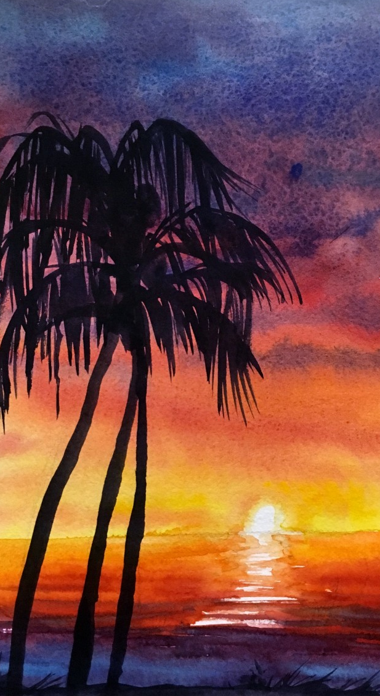
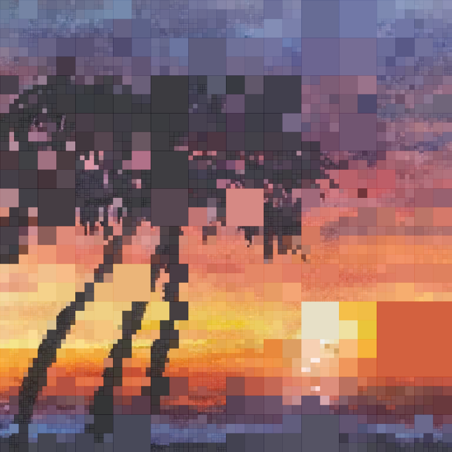
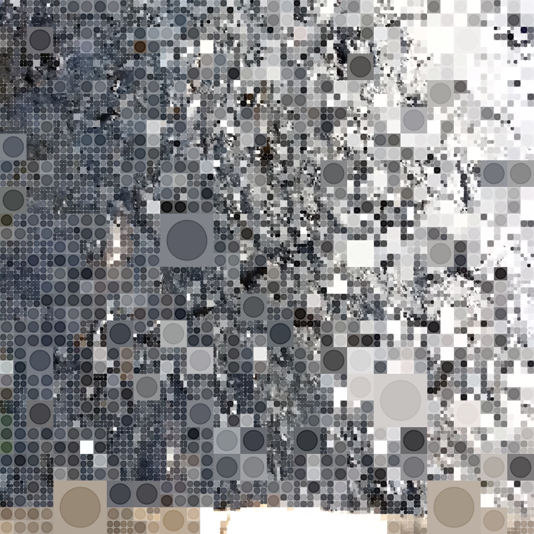

<div class="nav">
  <a href="../index.html">Home</a> | <a href="../picture-index.html">Picture Graphics</a> | <a href="../tutorials-index.html">Tutorials</a>
</div>

## Grid based generative art (part 3) - colors from an image.

The following are the previous tutorials in this series:
* [An introduction to grid based generative art](tutorials/generative-art-grid-intro.html).
* [Grid based generative art (part 2) - color and shape palettes](tutorials/generative-art-grid-part2.html).

---

In this tutorial, you will see how you can pick the colors for a grid cell based on the colors in any image of your choice. This can be done in a couple of different ways:
* For a grid cell, you choose a color based on the position of the cell and the color present at the corresponding position in the reference image.
* You create a palette out of the most frequently used colors in an image, and then you randomly choose from this palette (using a uniform or weighted strategy as described in the [previous article](./generative-art-grid-part2.html)).

### Approach 1 - Colors from the corresponding position in an image

The key idea is shown in the following code:

```scala
val img = image("some-image.png")
def imgColor(x: Double, y: Double) = {
    val nx = mathx.map(x, 0, cwidth, 0, img.getWidth).toInt
    val ny = mathx.map(y, 0, cheight, 0, img.getHeight).toInt
    getImagePixel(img, nx, ny)
}
```

For any grid position, the color from the corresponding position in the image can be obtained via the `imgColor` function defined above. This function makes use of `mathx.map(value, low1, high1, low2, high2)` to do its work. `mathx.map` maps the given value from the range (low1, high1) to the range (low2, high2).

Let's see this in action with a complete program. The program will make an irregular grid of rectangles, and color it using the colors from an image.

Here's the image:



And here's the program that uses the colors from the image:

---

```scala
size(900, 900)
cleari()
setBackground(cm.white)
originBottomLeft()
initRandomGenerator(-8312538470690622046L)

val tileCount = 3
val tileWidth = cwidth / tileCount
val tileHeight = cheight / tileCount

val img = image(url("http://docs.kogics.net/tutorials/sunset-tree.png"))
def imgColor(x: Double, y: Double) = {
    val nx = mathx.map(x, 0, cwidth, 0, img.getWidth).toInt
    val ny = mathx.map(y, 0, cheight, 0, img.getHeight).toInt
    getImagePixel(img, nx, ny)
}

def shape(w: Double, h: Double) = {
    Picture.rectangle(w, h)
}

case class Block(x: Double, y: Double, w: Double, h: Double) {
    val c = imgColor(x, y)
}
var blocks = ArrayBuffer.empty[Block]

def drawBlock(b: Block) {
    val pic = shape(b.w, b.h)
    pic.setPosition(b.x, b.y)
    val d = mathx.distance(b.x, b.y, mouseX, mouseY)
    val f = mathx.map(d, 0, 800, 0.3, .9)
    val angle = mathx.angle(b.x, b.y, mouseX, mouseY)
    pic.setFillColor(b.c.fadeOut(.2))
    pic.setPenColor(b.c.fadeOut(.3))
    pic.setPenThickness(.5)
    draw(pic)
}

def splitSomeBlocks(blocks: ArrayBuffer[Block], p: Double): ArrayBuffer[Block] = {
    val blocks2 = ArrayBuffer.empty[Block]
    repeatFor(blocks) { b =>
        if (randomDouble(1) < p) {
            val newBlocks = Array(
                Block(b.x, b.y, b.w / 2, b.h / 2),
                Block(b.x, b.y + b.h / 2, b.w / 2, b.h / 2),
                Block(b.x + b.w / 2, b.y, b.w / 2, b.h / 2),
                Block(b.x + b.w / 2, b.y + b.h / 2, b.w / 2, b.h / 2)
            )
            blocks2.appendAll(newBlocks)
        }
        else {
            blocks2.append(b)
        }
    }
    blocks2
}

setup {
    repeatFor(rangeTill(0, cheight, tileHeight)) { posY =>
        repeatFor(rangeTill(0, cwidth, tileWidth)) { posX =>
            val block = Block(posX, posY, tileWidth, tileHeight)
            blocks.append(block)
        }
    }
    repeat(7) {
        blocks = splitSomeBlocks(blocks, 0.5)
    }
}

setup {
    erasePictures()
    repeatFor(blocks) { b =>
        drawBlock(b)
    }
}
```



---

Let's try something similar with another image:


Here’s the program that uses the colors from the image:

---

```scala
size(900, 900)
cleari()
setBackground(white)
originBottomLeft()
initRandomGenerator(-8563875002700992940L)

val tileCount = 5
val tileWidth = cwidth / tileCount
val tileHeight = cheight / tileCount

val img = image(url("http://docs.kogics.net/tutorials/gray-fish.png"))
def imgColor(x: Double, y: Double) = {
    val nx = mathx.map(x, 0, cwidth, 0, img.getWidth).toInt
    val ny = mathx.map(y, 0, cheight, 0, img.getHeight).toInt
    getImagePixel(img, nx, ny)
}

def cellColor = randomColor

def shape(w: Double, h: Double) = {
    val len = math.min(w, h) * 3 / 4
    picStackCentered(noPen -> Picture.rectangle(w, h), Picture.ellipseInRect(len, len))
}

case class Block(x: Double, y: Double, w: Double, h: Double) {
    val c = imgColor(x, y)
}
var blocks = ArrayBuffer.empty[Block]

def drawBlock(b: Block) {
    val pic = shape(b.w, b.h)
    pic.setPosition(b.x, b.y)
    val d = mathx.distance(b.x, b.y, mouseX, mouseY)
    val f = mathx.map(d, 0, 800, 0.3, .9)
    val angle = mathx.angle(b.x, b.y, mouseX, mouseY)
    pic.setPenColor(b.c)
    pic.setFillColor(b.c.fadeOut(.3))
    pic.setPenThickness(2)
    draw(pic)
}

def splitSomeBlocks(blocks: ArrayBuffer[Block], p: Double): ArrayBuffer[Block] = {
    val blocks2 = ArrayBuffer.empty[Block]
    repeatFor(blocks) { b =>
        if (randomDouble(1) < p) {
            val newBlocks = Array(
                Block(b.x, b.y, b.w / 2, b.h / 2),
                Block(b.x, b.y + b.h / 2, b.w / 2, b.h / 2),
                Block(b.x + b.w / 2, b.y, b.w / 2, b.h / 2),
                Block(b.x + b.w / 2, b.y + b.h / 2, b.w / 2, b.h / 2)
            )
            blocks2.appendAll(newBlocks)
        }
        else {
            blocks2.append(b)
        }
    }
    blocks2
}

setup {
    repeatFor(rangeTill(0, cheight, tileHeight)) { posY =>
        repeatFor(rangeTill(0, cwidth, tileWidth)) { posX =>
            val block = Block(posX, posY, tileWidth, tileHeight)
            blocks.append(block)
        }
    }
    repeat(7) {
        blocks = splitSomeBlocks(blocks, 0.5)
    }
}

setup {
    erasePictures()
    repeatFor(blocks) { b =>
        drawBlock(b)
    }
}
```



---

### Approach 2 - Colors from an image extracted palette

Coming soon...