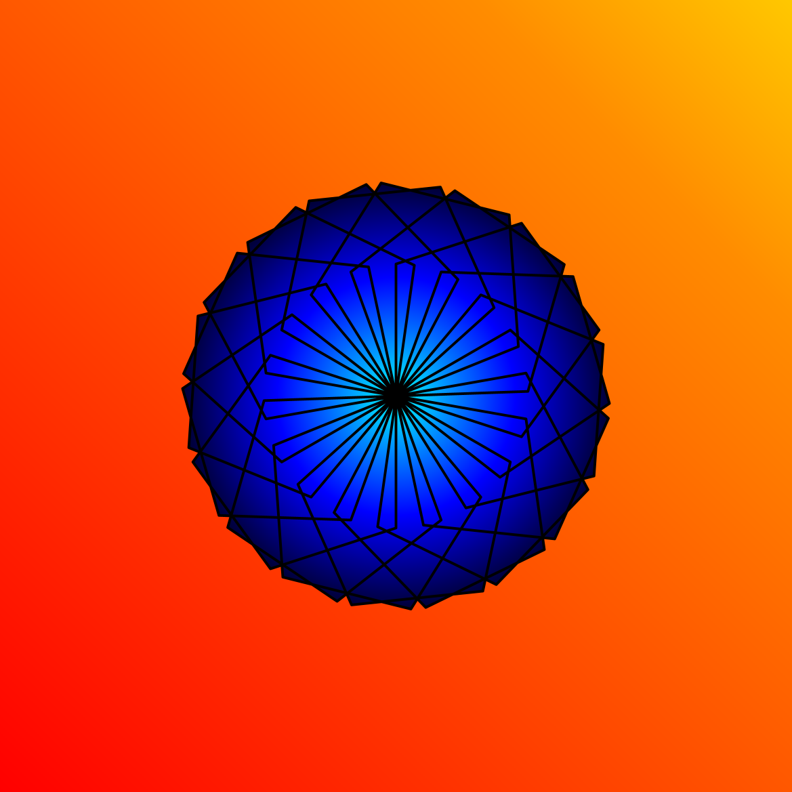

<div class="nav">
  <a href="../../index.html">Home</a> | <a href="index.html">Level 1s Index</a> | <a href="../../tutorials-index.html">Tutorials</a>
</div>

## Linear and Radial multi-gradients

This activity has the following desired goals:
* Learning about linear multi gradients (**A, M**).
* Learning about radial multi gradients (**A, M**).
* Learning to apply the above ideas to make pleasing drawings (**M, T**).

---

### Step 1

Type in the following code and run it:

```scala
clearOutput()
val numbers = List(1, 5, 3)
println(numbers(0))
println(numbers(1))
println(numbers(2))
```

**Q1a.** What do you think the above code is doing?

---

### Explanation

A List is a sequence of data values arranged one after the other with a well defined order of elements. e.g. `List(1, 5, 3)`.

Every element in a sequence can be located based on its position or index within the sequence. Positions (or indices) start from `0` and go upto `sequence-length - 1`. For a sequence `s` with three elements, the first element can be accessed as `s(0)`, the second element as `s(1)`, and the third element as `s(2)`.

If you want to arrange some data in your program in a List (which is an unchangeable sequence), you can use the `List` function to construct the list.

---

### Step 2

Type in the following code and run it:

```scala
clear()
setSpeed(fast)
val cb = canvasBounds
val clr = cm.linearMultipleGradient(cb.x, cb.y, cb.x + cb.width, cb.y + cb.height, List(0, 0.7, 1), List(red, yellow, orange))
setBackground(clr)
```

**Q2a.** What do you think is a linear color multi-gradient?

**Q2b.** The above code creates a multi-gradient from which point in the canvas to which point?

**Q2c.** What are the colors in the multi-gradient? How are these colors distributed between the start point and the finish point?

---

### Explanation

Function description:

* `cm.linearMultipleGradient(x1, y1, x2, y2, distribution, colors, cyclic)` - Creates a linear color multi-gradient between position `(x1, y1)` and position `(x2, y2)`. The gardient is spread across this range as per the `distribution` and `colors`; `distribution` is a sequence of fractions, and `colors` is a sequence of colors. Both sequences should have the same number of elements. So, for example, if the `distribution` is `List(0, 0.4, 1)` and colors is `List(red, blue, green)`, then the multi-gradient will be made out of `red` at the beginning of the range, `blue` at 40% of the range, and `green` at the end of the range. The `cyclic` parameter specifies whether the gradient should be repeated or not.

---

### Exploration

Create a linear multi-gradient to fill a rectangle.

---

### Step 3

Type in the following code and run it:

```scala
clear()
setSpeed(fast)
val cb = canvasBounds
val clr = cm.radialMultipleGradient(0, 0, cb.height / 2, List(0, 0.7, 1), List(red, yellow, orange))
setBackground(clr)
```

**Q3a.** What do you think is a radial color multi-gradient?

**Q3b.** The above code creates a gradient from which point in the canvas to which points?

**Q3c.** What are the colors in the multi-gradient? How are these colors distributed between the start point and the finish points?

---

### Explanation

Function description:

* `cm.linearMultipleGradient(x, y, r, distribution, colors, cyclic)` - Creates a radial color multi-gradient between position `(x, y)` as the center of a circle with radius `r` and the boundary of this circle. The gardient is spread across this range as per the `distribution` and `colors`; `distribution` is a sequence of fractions, and `colors` is a sequence of colors. Both sequences should have the same number of elements. So, for example, if the `distribution` is `List(0, 0.4, 1)` and colors is `List(red, blue, green)`, then the multi-gradient will be made out of `red` at the beginning of the range, `blue` at 40% of the range, and `green` at the end of the range. The `cyclic` parameter specifies whether the gradient should be repeated or not.

---

### Exploration

Create a radial multi-gradient to fill a rectangle.

---

### Exercise

Write a program to make the following drawing. The linear gradient background colors are -- `red`, `cm.darkOrange`, and `orange`. The radial gradient colors are -- `cyan`, `blue`, and `black`.




