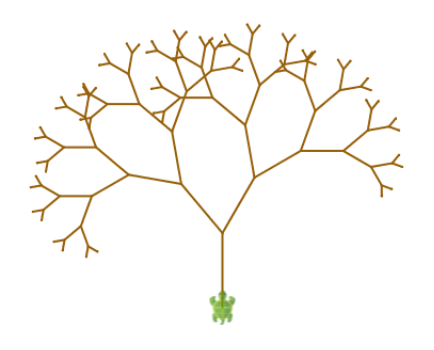

<div class="nav">
  <a href="../../index.html">Home</a> | <a href="index.html">Level 1s Index</a> | <a href="../../tutorials-index.html">Tutorials</a>
</div>

## Recursion

This activity has the following desired goals:
* Learning about self-similar structures (**A, M**).
* Learning to create commands and functions that call themselves (**A, M**).
* Learning to apply the above ideas to make pleasing drawings (**M, T**).

---

### Step 1

Type in the following code and run it:

```scala
def figure(n: Int) {
    forward(n)
    right(90)
    figure(n - 5)
}
clear()
figure(100)
```

**Q1a.** How does the above program work? Trace the program to determine the answer.

**Q1b.** What is wrong with the program?

---

### Step 2

Type in the following code and run it:

```scala
def figure(n: Int) {
    if (n < 10) {
        forward(n)
    }
    else {
        forward(n)
        right(90)
        figure(n - 5)
    }
}
clear()
figure(100)
```

**Q2a.** How does the program in this step improve upon the previous program?

---

### Step 3

Type in the following code and run it:

```scala
def numberPattern(n: Int): Int = {
    if (n == 1) 2 else numberPattern(n - 1) + 3
}
clearOutput()
repeatFor(1 to 5) { e =>
    println(numberPattern(e))
}
```

**Q3a.** Does this program use recursion with a command or a function?

**Q3b.** How does the program calulate the desired numbers? Use tracing to find out.

---

### Explanation

* A recursive command or function is useful when the solution to a problem depends on the solution to another (e.g. smaller) version of the same problem.
* A recursive command or function calls itself.
* Within a recursive command or function, you deal with a couple of different cases:
  * The base case. This handles the version of the problem that does not depend on any another version of the problem. The base case leads to the termination of a  recursive solution. Without the base case, a recursive solution will never stop.
  * The recursive case. This handles the version of the problem which depends on another (e.g. smaller) version of the problem.

---

### Exercise 

**1.** Write a program to make the something like the following figure (notice how the tree is made out of smaller trees; every tree has two smaller trees within it):



**2.** Write programs to print out the following number sequences:

1. 2 4 6 8 10 12
2. 2 7 12 17 22 27
3. 2 4 8 16 32 64
4. 1 2 3 5 8 13 21 34
5. 2 5 9 14 20 27
6. 1 1 2 6 24 120 840

*Hint* – Write functions that are able to generate the above sequences. Then call the functions
to obtain desired values and print these values out. Some functions are best written using
recursion. Others can make use of a formula that you discover to represent the given sequence.
