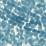

<div class="nav">
  <a href="../../index.html">Home</a> | <a href="index.html">Level 1s Index</a> | <a href="../../tutorials-index.html">Tutorials</a>
</div>

## Textures

This activity has the following desired goals:
* Learning to stroke and fill figures using textures (**A, M**).
* Learning to apply the above ideas to make pleasing drawings (**M, T**).

---

### Step 0



Save the above image in any folder on your computer. Let's say that the full path/name of the folder is `path/folder`.

---

### Step 1

Type in the following code and run it:

```scala
cleari()
setBackground(black)
setSpeed(fast)
val b1 = cm.texture("path/folder/brush1.png", 0, 0)
setPenColor(b1)
setPenThickness(18)
repeatFor(0 to 19) { n =>
    forward(200 - n * 10)
    right(90)
}
```

**Q1a** What is the color of the lines made by the above program?

**Q1b** What is the thickness of the lines made by the program?

**Q1c** How many lines does the program make?

**Q1d** What is the length of the longest line?

**Q1e** What is the length of the shortest line?

---

### Explanation

Wherever you can use a color or gradient in your program (for backgrounds, for pens, and for fills), you can also use a texture.

Function description:
* `cm.texture("image-file", x, y)` - creates a texture out of the given image. The texture is anchored at the given (x, y) coordinate.

---

### Step 2

Type in the following code and run it:

```scala
cleari()
setBackground(black)
setSpeed(fast)
val b1 = cm.texture("path/folder/brush1.png", 0, 0)
setFillColor(b1)
setPenThickness(2)
setPenColor(black)
repeatFor(0 to 19) { n =>
    println(n * 10)
    forward(200 - n * 10)
    right(90)
}
```

**Q2a** The program above makes a drawing that is similar to the drawing made by the program in `Step 1`. But it makes a drawing in a very different way. Explain the difference.

---

### Exercise

* Download a texture off the internet by, for example, doing a google search - [https://www.google.com/search?q=texture](https://www.google.com/search?q=texture), clicking on the `Images` link, and selecting a texture that you like.
* Use this texture to make a drawing of your choice. You can use the texture for either filling or stroking (i.e. setting pen color) of your drawing.


