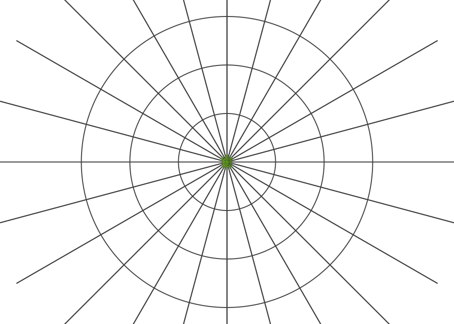

<div class="nav">
  <a href="../../index.html">Home</a> | <a href="index.html">Level 3 Index</a> | <a href="/modules/modules-index.html">Modules</a> | <a href="../../tutorials-index.html">Tutorials</a>
</div>

## Circular grids

This activity has the following desired goals:
* Learning to draw a circular grid (**A, M**).

---

### Step 1

Type in the following code and run it:

```scala
clear()
setBackground(white)
setSpeed(superFast)
setPenColor(darkGray)

def centeredCircle(r: Int) {
    savePosHe()
    right(90)
    hop(r)
    left(90)
    circle(r)
    restorePosHe()
}

repeatFor(0 to 5) { n =>
    val r = 50 + n * 50
    centeredCircle(r)
}

repeatFor(0 to 11) { i =>
    val n = i * 30
    savePosHe()
    left(n)
    hop(-500)
    forward(1000)
    restorePosHe()
}
```

**Q1a.** Read through the code above and try to understand what it does. What does the above code do? How does it do it?

---

### Exercise

**1** Write a program to make the following circular grid:


