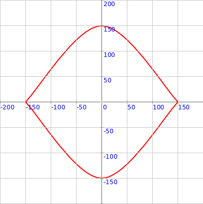
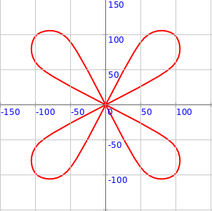

<div class="nav">
  <a href="../../index.html">Home</a> | <a href="index.html">Level 3 Index</a> | <a href="/modules/modules-index.html">Modules</a> | <a href="../../tutorials-index.html">Tutorials</a>
</div>

## Using vertex-shape Pictures to draw shapes

This activity has the following desired goals:
* Learning to draw **picture based** shapes using vertices at (r, theta) cordinates (**A, M**).
* Using the above ideas to make interesting curved figures (**M, T**).

---

### Step 1

Type in the following code and run it:

```scala
clear()
showAxes()
showGrid()

val pic = Picture.fromVertexShape { s =>
    import s._
    beginShape()
    curveVertexRt(150, 0)
    curveVertexRt(150, 0)
    curveVertexRt(150, 90)
    curveVertexRt(150, 180)
    curveVertexRt(150, 180)
    endShape()
}

draw(pic)
```

**Q1a.** Read through the code above and try to understand what it does. What does the above code do? How does it do it?

**Q1b.** How is the above code different from the very similar code in `Step 2` of the previous lesson?

---

### Explanation

Whatever figures you can make with the `beginShape()`, `vertex(x, y)`, `vertexRt(r, theta)`, `curveVertex(x, y)`, `curveVertexRt(r, theta)`, and `endShape()` turtle commands - can also be made using vertex-shape Pictures.

**Function Description:**

A vertex-shape Picture is created using the following function:

```scala
Picture.fromVertexShape { s =>
    import s._
    // your code with beginShape, vertex, curveVertex, endShape - goes here
}
```

Inside the function, the shape being constructed is available as a parameter (called `s` above). You can call the `beginShape()` etc. commands on this `s` as usual for objects - `s.beginShape()` etc. You can also just `import s._` and then call `beginShape()` etc without putting the `s.` in front.

---

### Exercise

**1** Write a program to make the following figure using first one and then two different vertex-shape Pictures:




**2** Write a program to make the following figure using first one and then four different vertex-shape Pictures:


