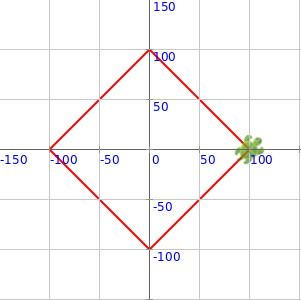
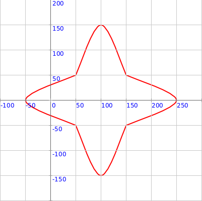

<div class="nav">
  <a href="../../index.html">Home</a> | <a href="index.html">Level 3 Index</a> | <a href="/modules/modules-index.html">Modules</a> | <a href="../../tutorials-index.html">Tutorials</a>
</div>

## Drawing Vertex based shapes

This activity has the following desired goals:
* Learning to draw shapes using vertices at (x, y) cordinates (**A, M**).
* Learning to draw curves using vertices at (x, y) cordinates (**A, M**).
* Using the above ideas to make interesting curved figures (**M, T**).

---

### Step 1

Type in the following code and run it:

```scala
clear()
showAxes()
showGrid()

beginShape()
vertex(50, 50)
vertex(100, 50)
vertex(100, 100)
endShape()
```

**Q1a.** Read through the code above and try to understand what it does. What does the above code do? How does it do it?

**Q1b.** What does the `vertex(x, y)` command do?


### Step 2

Type in the following code and run it:

```scala
clear()
setSpeed(fast)
showAxes()
showGrid()

beginShape()
curveVertex(50, 50)
curveVertex(50, 50)
curveVertex(150, 150)
curveVertex(250, 50)
curveVertex(250, 50)
endShape()
invisible()
```

**Q2a.** Read through the code above and try to understand what it does. What does the above code do? How does it do it?

**Q2b.** What does the `curveVertex(x, y)` command do?

**Q2c.** How many `curveVertex(x, y)` calls are required to make a curve?

Now type in the following code and run it:

```scala
clear()
setSpeed(fast)
showAxes()
showGrid()

beginShape()
curveVertex(0, 200)
curveVertex(50, 50)
curveVertex(150, 150)
curveVertex(250, 50)
curveVertex(300, 50)
endShape()
invisible()
```

**Q2d.** Do the first and last `curveVertex(x, y)` calls play a special role in defining the curve to be made?

---

### Explanation

**Command Descriptions:**

* `beginShape()` - begins a shape made out of vertices.
* `vertex(x, y)` - adds a vertex to the current shape at the given `(x, y)` location.
* `curveVertex(x, y)` - adds a curve vertex to the current shape at the given `(x, y)` location.
* `endShape()` - finishes the current shape and draws it out.

 
---

### Exercise

**1** Write a program to make the following figure using one (`beginShape` plus `vertex`es plus `endShape`) shape:




**2** Write a program to make the following figure using four different (`beginShape` plus `curveVertex`es plus `endShape`) shapes:




