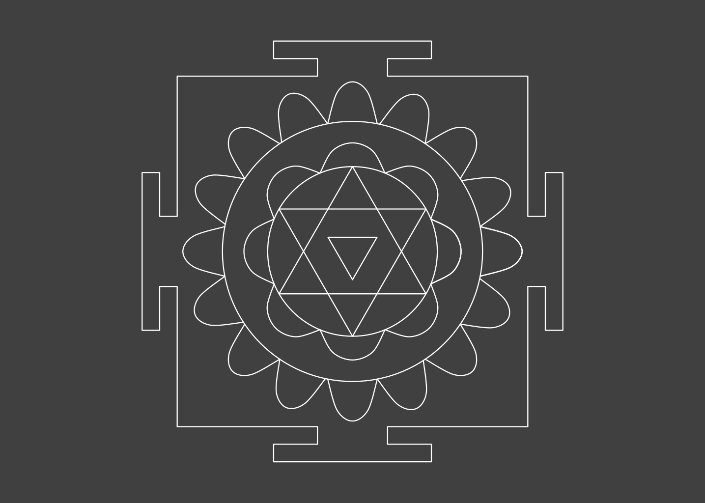
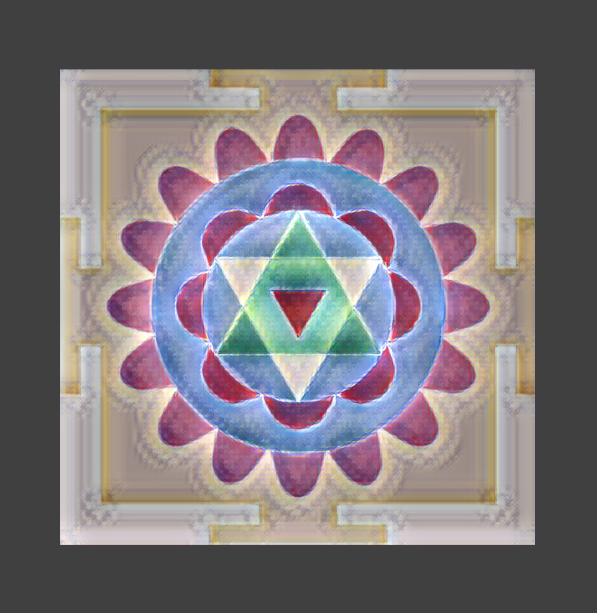
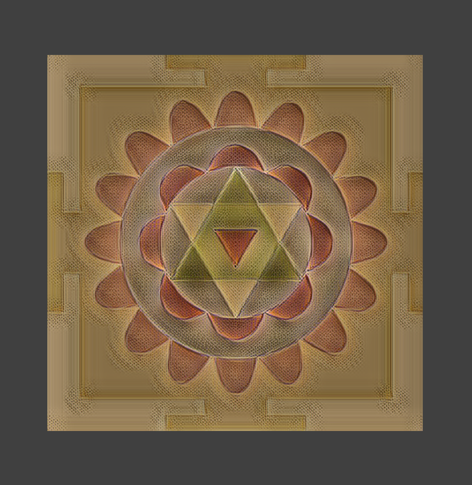

<div class="nav">
  <a href="../../index.html">Home</a> | <a href="index.html">Level 3 Index</a> | <a href="/modules/modules-index.html">Modules</a> | <a href="../../tutorials-index.html">Tutorials</a>
</div>

## Sample Mandala 3

This activity has the following desired goals:
* Learning how the pre-defined mandala building blocks can be brought together to create a Mandala (**A, M**).
* Learn to refine a given piece of artistic code to make it visually more pleasing.

### Setup

*If not already done*, download the [mandala-shapes.kojo](mandala-shapes.kojo) file and save it at a known location on your computer. 

This file contains definitions for all the pre-defined mandala building-block shapes that you played with in the [Mandala building blocks](mandala-building-blocks.html) lesson. You will include this file in your Mandala drawing code (as shown below), so that you have access to these shapes.

### Mandala Code

Type in the following code and run it:


```scala
// #include /path/to/mandala-shapes.kojo

cleari()
setBackground(darkGray)

val pics = ArrayBuffer.empty[Picture]


pics.append(penColor(white) * fillColor(noColor) -> inscribedTriangle(50, 270))
pics.append(penColor(white) * fillColor(noColor) -> inscribedTriangle(150, 90))
pics.append(penColor(white) * fillColor(noColor) -> inscribedTriangle(150, 270))


pics.append(penColor(white) * fillColor(noColor) -> Picture.circle(150))

repeatFor(0 to 8) { n =>
    val pic2 = penColor(white) * fillColor(noColor) ->
        semiCircularPetal(150, n * 45, 45)
    pics.append(pic2)
}

pics.append(penColor(white) * fillColor(noColor) -> Picture.circle(230))


repeatFor(0 to 16) { n =>
    val pic2 = penColor(white) * fillColor(noColor) ->
        roundedPetal(230, 300, n * 45/2, 45/2)
    pics.append(pic2)
}


pics.append(penColor(white) * fillColor(noColor) -> altar(310, 0.2, 0))

draw(pics.reverse)

zoom(0.75)
```



**Q1a.** How does the above code work? Explain to a friend.

### Exercise

Change the color scheme for the mandala. You can play with the following:
* Changing pen colors
* Changing fill colors
* Applying neural style transfer

Here are some sample colored and style-transferred drawings based on the above mandala:



---


