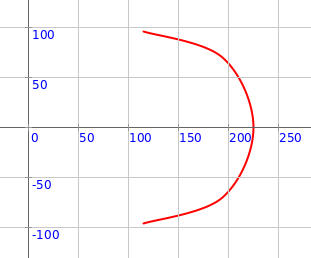
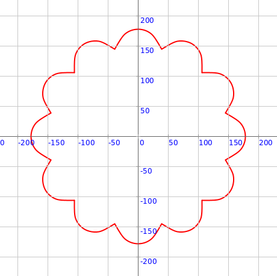
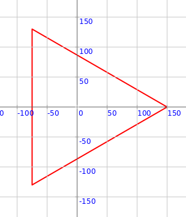
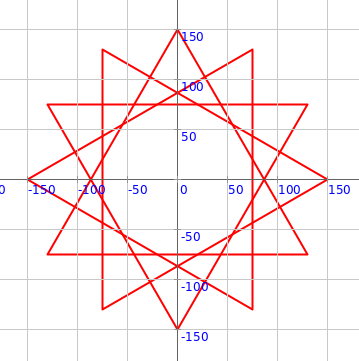
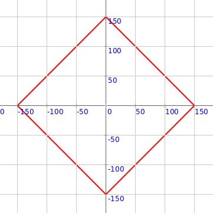
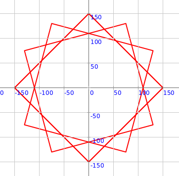
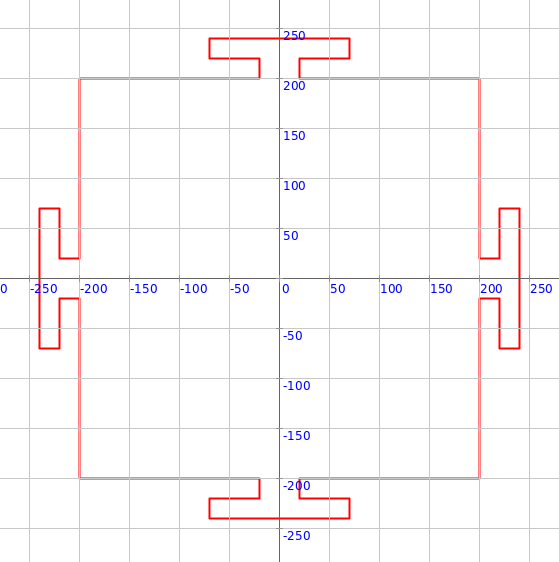
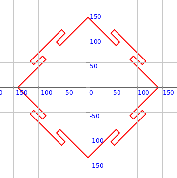

<div class="nav">
  <a href="../../index.html">Home</a> | <a href="index.html">Level 3 Index</a> | <a href="/modules/modules-index.html">Modules</a> | <a href="../../tutorials-index.html">Tutorials</a>
</div>

## Mandala Building Blocks - 2

This activity has the following desired goals:
* Learning about the different pre-defined mandala building blocks (**A, M**).

---

* [Building Block 5 - Semi Circular Petal](#building-block-5---semi-circular-petal)
* [Building Block 6 - Inscribed Triangle](#building-block-6---inscribed-triangle)

---

### Building Block 5 - Semi Circular Petal

Type in the following code and run it:

```scala
def semiCircularPetal(radius: Double, theta: Double, thetaExtent: Double) = Picture.fromVertexShape { s =>
    val tDelta = thetaExtent / 2
    import s._
    beginShape()

    curveVertexRt(radius, theta - tDelta)
    curveVertexRt(radius, theta - tDelta)

    curveVertexRt(radius + (0.7010526 * thetaExtent), theta - tDelta / 2)

    curveVertexRt(radius + (0.93333 * thetaExtent), theta)

    curveVertexRt(radius + (0.7010526 * thetaExtent), theta + tDelta / 2)

    curveVertexRt(radius, theta + tDelta)
    curveVertexRt(radius, theta + tDelta)

    endShape()
}

cleari()
showAxes()
showGrid()
val pic = semiCircularPetal(150, 0, 80)
draw(pic)
```



**Q5a.** The code above makes one semi circular petal. What is its radius? What is its direction (theta)? What is it's spread (thetaExtent)?

---

#### Exploration

Play with the inputs to the `semiCircularPetal` function above to make different kinds of petals.

---

#### Exercise

Make the following circular pattern:



---

### Building Block 6 - Inscribed Triangle

Type in the following code and run it:

```scala
def inscribedTriangle(vertexR: Double, vertexTheta: Double) = Picture.fromVertexShape { s =>
    import s._
    beginShape()
    vertexRt(vertexR, vertexTheta)
    vertexRt(vertexR, vertexTheta + 120)
    vertexRt(vertexR, vertexTheta + 240)
    vertexRt(vertexR, vertexTheta)
    endShape()
}

cleari()
showAxes()
showGrid()
val pic = inscribedTriangle(150, 0)
draw(pic)
```



**Q6a.** The code above makes one inscribed triangle. What is its circumscribing radius? What is its direction (theta)?

---

#### Exploration

Play with the inputs to the `inscribedTriangle` function above to make different kinds of triangles.

---

#### Exercise

Make the following circular pattern:



---

### Building Block 7 - Inscribed Square

Type in the following code and run it:

```scala
def inscribedSquare(vertexR: Double, vertexTheta: Double) = Picture.fromVertexShape { s =>
    import s._
    beginShape()
    vertexRt(vertexR, vertexTheta)
    vertexRt(vertexR, vertexTheta + 90)
    vertexRt(vertexR, vertexTheta + 180)
    vertexRt(vertexR, vertexTheta + 270)
    vertexRt(vertexR, vertexTheta)
    endShape()
}

cleari()
showAxes()
showGrid()
val pic = inscribedSquare(150, 0)
draw(pic)
```



**Q7a.** The code above makes one inscribed square. What is its circumscribing radius? What is its direction (theta)?

---

#### Exploration

Play with the inputs to the `inscribedSquare` function above to make different kinds of squares.

---

#### Exercise

Make the following circular pattern:



---

### Building Block 8 - Altar

Type in the following code and run it:

```scala
def altar(r: Double, gateRFraction: Double, gateTheta: Double) = Picture {
    setHeading(gateTheta)
    hop(r)
    left(90)
    val glen = r * gateRFraction
    hop(glen)
    repeat(4) {
        forward(r - glen)
        left()
        forward(r - glen)
        right()
        forward(r / 10)
        right()
        forward(r / 4)
        left()
        forward(r / 10)
        left()
        forward(r / 4)
        forward(glen * 2)
        forward(r / 4)
        left()
        forward(r / 10)
        left()
        forward(r / 4)
        right()
        forward(r / 10)
        right(90)
    }
}

cleari()
showAxes()
showGrid()
val pic = altar(200, 0.1, 0)
draw(pic)
```



**Q8a.** The code above makes an altar. What is its inscribing radius? What is its direction (theta)?

---

#### Exploration

Play with the inputs to the `altar` function above to make different kinds of altars.

---

#### Exercise

Make the following circular pattern:



---

More building blocks coming soon...
