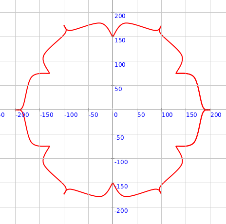
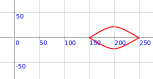
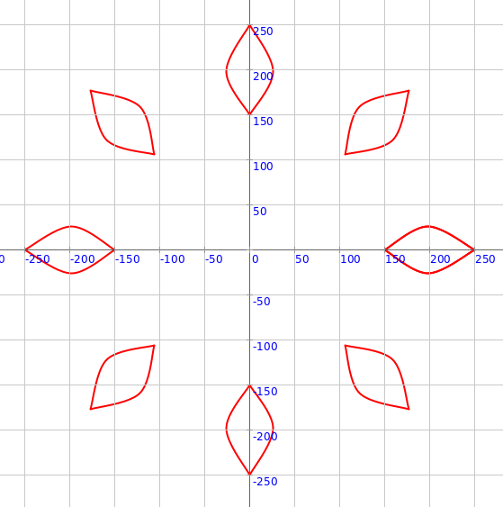
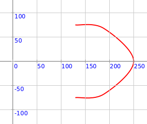
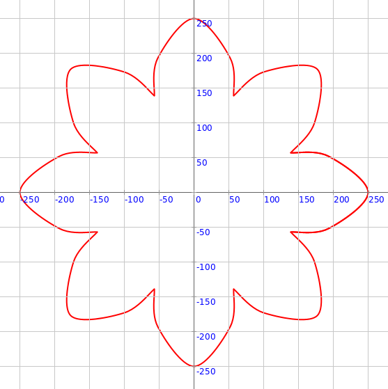
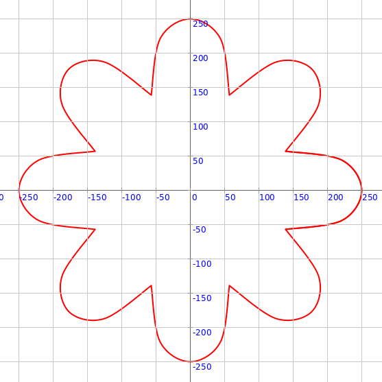

<div class="nav">
  <a href="../../index.html">Home</a> | <a href="index.html">Level 3 Index</a> | <a href="/modules/modules-index.html">Modules</a> | <a href="../../tutorials-index.html">Tutorials</a>
</div>

## Mandala Building Blocks

This activity has the following desired goals:
* Learning about the different pre-defined mandala building blocks (**A, M**).

---

* [Building Block 1 - Lotus Petal](#building-block-1---lotus-petal)
* [Building Block 2 - Diya](#building-block-2---diya)
* [Building Block 3 - Pointed Petal](#building-block-3---pointed-petal)

---

### Building Block 1 - Lotus Petal

Type in the following code and run it:

```scala
def lotusPetal(radius: Double, radiusOuter: Double,
               theta: Double, thetaExtent: Double) = Picture.fromVertexShape { s =>
    import s._
    val tDelta = thetaExtent / 2
    beginShape()
    curveVertexRt(radius, theta - tDelta)
    curveVertexRt(radius, theta - tDelta)

    val rExtent = radiusOuter / radius

    curveVertexRt(mathx.lerp(radius, radius * rExtent, 0.6), theta - tDelta * 22 / 30)
    curveVertexRt(mathx.lerp(radius, radius * rExtent, 0.7), theta - tDelta * 2 / 30)
    curveVertexRt(radius * rExtent, theta)
    curveVertexRt(mathx.lerp(radius, radius * rExtent, 0.7), theta + tDelta * 2 / 30)
    curveVertexRt(mathx.lerp(radius, radius * rExtent, 0.6), theta + tDelta * 22 / 30)

    curveVertexRt(radius, theta + tDelta)
    curveVertexRt(radius, theta + tDelta)
    endShape()
}

cleari()
showAxes()
showGrid()
val pic = lotusPetal(150, 200, 0, 60)
draw(pic)
```


**Q1a.** The code above makes one lotus petal. What is its radius? What is its outer radius? What is its direction (theta)? What is it's spread (thetaExtent)?

---

#### Exploration

Play with the inputs to the `lotusPetal` function above to make different kinds of petals.

---

Type in the following code and run it:

```scala
def lotusPetal(radius: Double, radiusOuter: Double,
               theta: Double, thetaExtent: Double) = Picture.fromVertexShape { s =>
    import s._
    val tDelta = thetaExtent / 2
    beginShape()
    curveVertexRt(radius, theta - tDelta)
    curveVertexRt(radius, theta - tDelta)

    val rExtent = radiusOuter / radius

    curveVertexRt(mathx.lerp(radius, radius * rExtent, 0.6), theta - tDelta * 22 / 30)
    curveVertexRt(mathx.lerp(radius, radius * rExtent, 0.7), theta - tDelta * 2 / 30)
    curveVertexRt(radius * rExtent, theta)
    curveVertexRt(mathx.lerp(radius, radius * rExtent, 0.7), theta + tDelta * 2 / 30)
    curveVertexRt(mathx.lerp(radius, radius * rExtent, 0.6), theta + tDelta * 22 / 30)

    curveVertexRt(radius, theta + tDelta)
    curveVertexRt(radius, theta + tDelta)
    endShape()
}

cleari()
showAxes()
showGrid()
val pics = ArrayBuffer.empty[Picture]
repeatFor(0 to 6) { n =>
    val pic = lotusPetal(150, 200, n * 60, 60)
    pics.append(pic)
}
draw(pics)
```



**Q1b.** How does the above code make lotus petals in a circular pattern?

---

#### Exploration

Play with the above code to make different kinds of circular patterns

---

### Building Block 2 - Diya

Type in the following code and run it:

```scala
def diya(radius: Double, radiusOuter: Double,
         theta: Double, thetaExtent: Double) = Picture.fromVertexShape { s =>
    import s._
    val tDelta = thetaExtent / 2
    val rExtent = radiusOuter / radius
    beginShape()
    curveVertexRt(radius, theta)
    curveVertexRt(radius, theta)
    curveVertexRt(mathx.lerp(radius, radius * rExtent, 0.5), theta - tDelta / 4)
    curveVertexRt(radius * rExtent, theta)
    curveVertexRt(radius * rExtent, theta)
    endShape()

    beginShape()
    curveVertexRt(radius * rExtent, theta)
    curveVertexRt(radius * rExtent, theta)
    curveVertexRt(mathx.lerp(radius, radius * rExtent, 0.5), theta + tDelta / 4)
    curveVertexRt(radius, theta)
    curveVertexRt(radius, theta)
    endShape()
}

cleari()
showAxes()
showGrid()
val pic = diya(150, 250, 0, 50)
draw(pic)
```



**Q2a.** The code above makes one diya. What is its radius? What is its outer radius? What is its direction (theta)? What is it's spread (thetaExtent)?

---

#### Exploration

Play with the inputs to the `diya` function above to make different kinds of diyas.

---

#### Exercise

Make the following circular pattern:



---

### Building Block 3 - Pointed Petal

Type in the following code and run it:

```scala
def pointedPetal(radius: Double, radiusOuter: Double,
                 theta: Double, thetaExtent: Double) = Picture.fromVertexShape { s =>
    val tDelta = thetaExtent / 2
    import s._
    beginShape()

    curveVertexRt(radius, theta - tDelta)
    curveVertexRt(radius, theta - tDelta)

    curveVertexRt(radius + (radiusOuter - radius) / 2, theta - 2 * tDelta / 3)

    curveVertexRt(radiusOuter, theta)

    curveVertexRt(radius + (radiusOuter - radius) / 2, theta + 2 * tDelta / 3)

    curveVertexRt(radius, theta + tDelta)
    curveVertexRt(radius, theta + tDelta)

    endShape()
}

cleari()
showAxes()
showGrid()
val pic = pointedPetal(150, 250, 0, 60)
draw(pic)
```



**Q3a.** The code above makes one pointed petal. What is its radius? What is its outer radius? What is its direction (theta)? What is it's spread (thetaExtent)?

---

#### Exploration

Play with the inputs to the `pointedPetal` function above to make different kinds of petals.

---

#### Exercise

Make the following circular pattern:



---

### Building Block 4 - Rounded Petal

Type in the following code and run it:

```scala
def roundedPetal(radius: Double, radiusOuter: Double,
                 theta: Double, thetaExtent: Double) = Picture.fromVertexShape { s =>
    val tDelta = thetaExtent / 2
    import s._
    implicit val s2 = s
    beginShape()

    curveVertexRt(radius, theta - tDelta)
    curveVertexRt(radius, theta - tDelta)

    curveVertexRt(radius + 3 * (radiusOuter - radius) / 4, theta - tDelta / 2)

    curveVertexRt(radiusOuter, theta)

    curveVertexRt(radius + 3 * (radiusOuter - radius) / 4, theta + tDelta / 2)

    curveVertexRt(radius, theta + tDelta)
    curveVertexRt(radius, theta + tDelta)

    endShape()
}

cleari()
showAxes()
showGrid()
val pic = roundedPetal(150, 250, 0, 40)
draw(pic)
```


**Q4a.** The code above makes one rounded petal. What is its radius? What is its outer radius? What is its direction (theta)? What is it's spread (thetaExtent)?

---

#### Exploration

Play with the inputs to the `roundedPetal` function above to make different kinds of petals.

---

#### Exercise

Make the following circular pattern:



---

More coming...