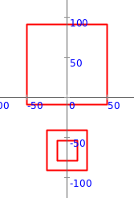

<div class="nav">
  <a href="../../index.html">Home</a> | <a href="index.html">Level 3 Index</a> | <a href="/modules/modules-index.html">Modules</a> | <a href="../../tutorials-index.html">Tutorials</a>
</div>

## Picture Layout

This activity has the following desired goals:
* Learning to lay out pictures in rows, columns, and stacks (**A, M**).

### Step 1

Type in the following code and run it:

```scala
cleari()
showAxes()
val pic1 = Picture.rectangle(100, 100)
val pic2 = Picture.rectangle(50, 50)
val pic3 = Picture.rectangle(25, 25)
val pics = picRow(pic1, pic2, pic3)
draw(pics)
```

**Q1a.** What does the above code do? Explain to a friend.

**Q1b.** What do you think the `picRow` function does?


---

#### Self Exploration

1. Instead of using `picRow` in the code above, use `picRowCentered`. How does that change the output?
1. Instead of using `draw` in the code above, use `drawCentered`. How does that change the output?

---

### Step 2

Type in the following code and run it:

```scala
cleari()
showAxes()
val pic1 = Picture.rectangle(100, 100)
val pic2 = Picture.rectangle(50, 50)
val pic3 = Picture.rectangle(25, 25)
val pics = picColCentered(pic1, pic2, pic3)
drawCentered(pics)
```

**Q2a.** What do you think the `picColCentered` function does?

---

### Step 3

Type in the following code and run it:

```scala
cleari()
showAxes()
val pic1 = Picture.rectangle(100, 100)
val pic2 = Picture.rectangle(50, 50)
val pic3 = Picture.rectangle(25, 25)
val pics = picStackCentered(pic1, pic2, pic3)
drawCentered(pics)
```

**Q3a.** What do you think the `picStackCentered` function does?

---

### Step 4

Type in the following code and run it:

```scala
cleari()
showAxes()
val pic1 = Picture.rectangle(100, 100)
val pic2 = Picture.rectangle(50, 50)
val pic3 = Picture.rectangle(25, 25)

val row = picRowCentered(pic2, pic3)
val col = picColCentered(pic1, row)
drawCentered(col)
```

**Q4a.** What does the above code do? Explain to a friend.

---

### Step 5

Type in the following code and run it:

```scala
cleari()
showAxes()
val pic1 = Picture.rectangle(100, 100)
val pic2 = Picture.rectangle(50, 50)
val pic3 = Picture.rectangle(25, 25)

val row = picRowCentered(pic2, Picture.hgap(10), pic3)
val col = picColCentered(pic1, Picture.vgap(30), row)
drawCentered(col)
```

**Q5a.** What does the above code do? Explain to a friend.

**Q5b** What do you think the `Picture.hgap` function does?

**Q5c** What do you think the `Picture.vgap` function does?

---

### Explanation

Multiple pictures can be laid out in the following ways:

| Layout type | Function for layout (with centering) | Function for layout (without centering) |
| :--- | :--- | :--- |
| row - left to right | `picRowCentered(pic1, pic2, ...)` | `picRow(pic1, pic2, ...)` |
| column - bottom to top | `picColCentered(pic1, pic2, ...)` | `picCol(pic1, pic2, ...)` |
| stack - one over the other | `picStackCentered(pic1, pic2, ...)` | `picStack(pic1, pic2, ...)` |  

#### Useful functions:

* `Picture.hgap(width)` - Creates an invisible picture with the given width. This can be used during picture layout - to provide horizontal spacing.
* `Picture.vgap(height)` - Creates an invisible picture with the given height. This can be used during picture layout - to provide vertical spacing.

---

### Exercise

Write a program to make the following figure:




