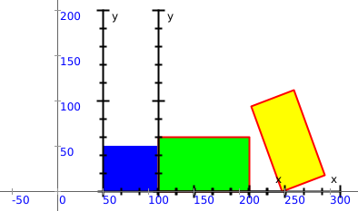

<div class="nav">
  <a href="../index.html">Home</a> | <a href="../picture-index.html">Picture Graphics</a> 
</div>

## An introduction to Pictures
A picture is a visual element in Kojo. To work with a picture, you do the following:
* [Create the picture](#picture-creation)
* [Transform it](#picture-transformation) (optional)
* [Lay it out by aligning it with other pictures](#picture-layout) (optional)
* [Use functions for powerful layout and transformation](#picture-layout-with-functions) (optional)
* [Apply effects to it](#picture-effects) (optional)
* [Draw it](#picture-drawing)
* [Animate it as you continue to transform it](#picture-animation) (optional)
* [Check for collisions with other pictures](#picture-collisions) (optional)
* [Attach mouse event handlers to it to interact with it](#picture-event-handlers) (optional)

The above Picture capabilites enable the following:
* Functional and Generative art
* Gaming

### Picture Creation
A picture can be created using any one of the functions shown below. There are a couple of things that you should be aware of:  
* A newly created picture is located at at the canvas position (0, 0) to begin with. It can then be positioned at any other location by using the `pic.setPosition(x, y)` command or being part of a row, column, or stack of pictures.
* Normally, a picture's position is the location of it's bottom-left corner. Exceptions to this are the ellipse, the circle, and the arc, which are positioned at their center.

| Function | Description |
| :--- | :--- |
| `Picture {turtle drawing code}` | Creates a picture from the given turtle drawing. |
| `Picture.line(width, height)` | Creates a picture of a line with the given width and height. |
| `Picture.rectangle(width, height)` | Creates a picture of a rectangle with the given width and height. |
| `Picture.circle(radius)` | Creates a picture of a circle with the given radius. The center of the circle is at (0, 0) |
| `Picture.ellipse(xRadius, yRadius)` | Creates a picture of an ellipse with the given xRadius and yRadius. The center of the ellipse is at (0, 0) |
| `Picture.ellipseInRect(width, height)` | Creates a picture of an ellipse with the given width and height. |
| `Picture.point` | Creates a picture of a point. |
| `Picture.arc(radius, angle)` | Creates a picture of an arc with the given radius and angle. The center of the arc is at (0, 0). |
| `Picture.text(string)` | Creates a picture with the given text. |
| `Picture.hgap(width)` | Creates an invisible picture with the given width. This can be useful during picture layout |
| `Picture.vgap(width)` | Creates an invisible picture with the given height. This can be useful during picture layout |
| `Picture.image(fileName)` | Creates a picture with the image in the given file. |
| `Picture.image(url)` | Creates a picture with the image at the given file link. |
| `Picture.image(image)` | Creates a picture with the given image. |

#### Example

---

```scala
cleari()
showAxes()
val pic1 = Picture.rectangle(100, 50)
val pic2 = Picture.circle(50)
draw(pic1, pic2)
```


---

#### Exercise

Use all the picture creation functions listed above (except `hgap` and `vgap`) to create and draw pictures.

### Picture Transformation
You can transform pictures in the following main ways (every transformation below is shown via a tranformation object/function and a transformation method/command):

| Transformation | Object/function | Method/command |
| :--- | :--- | :--- |
| rotate | `rot(angle) -> pic` | `pic.rotate(angle)` |
| scale | `scale(f) -> pic` | `pic.scale(f)` |
| translate (in its local coordinate system) | `trans(x, y) -> pic` | `pic.translate(x, y)` |
| translate (in its parent's coordinate system) | `offset(x, y) -> pic` | `pic.offset(x, y)` |
| position at a given location | `offset(x, y) -> pic` (one time) | `pic.setPosition(x, y)` |
| change pen color | `penColor(color) -> pic` | `pic.setPenColor(color)` |
| change pen thickness | `penThickness(t) -> pic` | `pic.setPenThickness(t)` |
| set no pen | `noPen -> pic` | `pic.setNoPen()` | 
| change fill color | `fillColor(color) -> pic` | `pic.setFillColor(color)` |
| set opacity | `opac(o) -> pic` | `pic.setOpacity(o)` | 

As shown above, there are two distinct ways of doing picture transformations:
* The object/function way, e.g., `trans(100, 0) -> pic` - which is useful while doing functional/compositional graphics. This way of doing transformations can be used only before a picture is drawn (and these transformations are applied when the picture is drawn).
* The method/command way, e.g.. `pic.translate(100, 0)` - which is useful while doing generative art or gaming. This way of doing transformations can be used before and after a picture is drawn.


Multiple transformations can be combined in the following ways:
* tranformation objects/functions are combined using `*`, e.g., `trans(100, 0) * rot(45) -> pic`
* transformation methods/commands are combined by sequential calls, e.g., `pic.translate(100, 0); pic.rotate(45)`


The following example shows the exact same figure being drawn using the two different ways of doing transformations:

---

```scala
cleari()
showAxes()
val pic = trans(100, 0) * rot(45) * penColor(blue) -> Picture.rectangle(100, 50)
draw(pic)
```

```scala
cleari()
showAxes()
val pic = Picture.rectangle(100, 50)
pic.translate(100, 0)
pic.rotate(45)
pic.setPenColor(blue)
draw(pic)
```


---

### Picture Layout
Multiple pictures can be laid out in the following ways:

| Layout type | Function for layout (with centering) | Function for layout (without centering) |
| :--- | :--- | :--- |
| stack - one on top of the other | `picStackCentered(pic1, pic2, ...)` | `picStack(pic1, pic2, ...)` |
| row - left to right | `picRowCentered(pic1, pic2, ...)` | `picRow(pic1, pic2, ...)` |
| column - bottom to top | `picColCentered(pic1, pic2, ...)` | `picCol(pic1, pic2, ...)` |

#### Examples

---

```scala
cleari()
showAxes()
val pic1 = Picture.rectangle(50, 50)
val pic2 = Picture.rectangle(100, 50)
val pic3 = Picture.rectangle(50, 100)
val pics = picColCentered(pic1, pic2, pic3)
draw(pics)
```


---
---

```scala
cleari()
showAxes()
val pic1 = Picture.rectangle(50, 50)
val pic2 = rot(45) * fillColor(blue) -> Picture.rectangle(100, 50)
val pic3 = scale(1.5) * penColor(green) -> Picture.rectangle(50, 100)
val pics = picColCentered(pic1, pic2, pic3)
draw(pics)
```


---
---

```scala
cleari()
showAxes()
val pic1 = Picture.rectangle(100, 50)
val pic2 = picRowCentered(Picture.rectangle(25, 50), Picture.hgap(48), Picture.rectangle(25, 50))
val pic3 = Picture.rectangle(100, 50)
val pics = picColCentered(pic1, pic2, pic3)
draw(pics)
```


---

The following example uses recursion to make an interesting figure (recursion will be explained in detail in a separate article):

---

```scala
cleari()
def p(n: Int): Picture = {
    if (n < 10) {
        Picture.rectangle(n, n)
    }
    else {
        picStack(Picture.rectangle(n, n), trans(10, 0) * rot(2) -> p(n - 15))
    }
}
draw(penColor(blue) * penThickness(3) -> p(250))
```


---

#### Exercise
Write programs to make the figures shown below using the following instructions:
* `Picture.rectangle`
* `Picture.text`
* `Picture.hgap`
* `picColCentered`
* `picRowCentered`
* `penColor`
* `draw`


#### Picture coordinate systems

The following example shows you three different coordinate systems in action when you create a transformed row of pictures.

---

```scala
cleari()
val pic1 = trans(60, 0) -> Picture.rectangle(60, 50)
val pic2 = rot(20) -> Picture.rectangle(100, 60)
val pic3 = Picture.rectangle(50, 100)
val pics = rot(45) * trans(50, 0) -> picRow(pic1, pic2, pic3)
draw(pics)
showAxes()
Picture.showAxes(pics, pic2)
```



---

In the figure above, you see the axes for the following coordinate systems:
* The canvas coordinate system
* The coordinate system for `pics`, which lives within the coordinate system of its parent - the canvas (pics.position is (35.36, 35.36)).
* The coordinate system for `pic2`, which lives within the coordinate system of its parent - `pics` (pic2.position is (121.00, 0.00)).

### Picture layout with Functions

Because Pictures are like any other data values, they can be transformed using functions. This is the great benefit of splitting the drawing of pictures into two or more steps - the creation (which just creates the data value), the optional transformation of the data via functions, and the drawing of the final data via a command.

The example below shows some of this in action with your own transformation functions (which build upon the transformation functions provided by Kojo):

---

```scala
cleari()
def two(p: Picture) = picRow(p, p)
def four(p: Picture) = picCol(two(p), two(p))
def checker(p1: Picture, p2: Picture) = {
    picCol(
        picRow(p1, p2),
        picRow(p2, p1)
    )
}
val pic1 = penColor(cm.darkGray) * fillColor(cm.blue) -> Picture.rectangle(50, 50)
val pic2 = penColor(cm.darkGray) * fillColor(cm.green) -> Picture.rectangle(50, 50)
val pic = four(checker(pic1, pic2))
draw(pic)
```


---

### Picture Effects

After you create a picture, you can apply effects to it via image filters. 

Kojo includes a bunch of [image filters from JH Labs](http://www.jhlabs.com/ip/filters/). To use these filters effectively, it's best to (for now) just [look at the JavaDoc in the source code](https://github.com/litan/jhlabs-image-filters/tree/master/src/com/jhlabs/image).

The general approach while using these filters is to:
* create the filter - e.g. `val filter = new com.jhlabs.image.WeaveFilter`
* change the filter parameters as desired - e.g. `filter1.setXGap(10)`
* apply the effect to a picture - e.g. `val pic2 = effect(filter) -> pic`
  * multiple effects can be composed together - e.g. `val pic2 = effect(filter1) * effect(filter2) -> pic`
* draw the picture with effects - `draw(pic2)`


#### Examples

---

```scala
cleari()
val pic = fillColor(red) -> Picture.rectangle(400, 400)
val filter1 = new com.jhlabs.image.WeaveFilter
filter1.setXGap(10)
filter1.setXWidth(50)
val filter2 = new com.jhlabs.image.NoiseFilter
filter2.setAmount(100)
filter2.setDensity(1)
val pic2 = effect(filter1) * effect(filter2) -> pic
drawCentered(pic2)
```


---

---

```scala
cleari()
val pic = penColor(cm.black) * fillColor(cm.darkOliveGreen) -> Picture {
    val n = mathx.lcm(85, 360)
    repeat(n / 85) {
        forward(250)
        right(85)
    }
}

val filter1 = new com.jhlabs.image.LightFilter
val light = new filter1.SpotLight()
light.setCentreX(0.7f)
light.setCentreY(0.35f)
light.setAzimuth(135.toRadians)
light.setElevation(.5f)
light.setDistance(300f)
light.setConeAngle(30.toRadians)
filter1.addLight(light)
val filter2 = new com.jhlabs.image.NoiseFilter
filter2.setAmount(30)
filter2.setDensity(1)
val pic2 = effect(filter1) * effect(filter2) -> pic
drawCentered(pic2)
```


---

Some things to note:
* When an effect is applied to a (vector) picture, it is converted to an image before the effect is applied. You need to be aware of this if you want to export/print the output at high resolution (a separate article will go into this in more detail).
* You are not limited to using the bundled JH Labs image filters for effects. You can use filters from any Java (or Scala) image processing library (after downloading it and putting it in the Kojo `libk` directory).


### Picture Drawing
You can draw a picture `pic` in a few different ways:
* `draw(pic)` - draws the picture.
* `pic.draw()` - similar to the above.
* `drawCentered(pic)` - draws the picture centered in the canvas.

The draw command can also be used to draw multiple pictures:
* `draw(pic1, pic2, ...)`

Also, for the purpose of 'debugging', you can see the local coordinate system axes and bounds of one or more pictures via the following commands:
* `Picture.showAxes(pic)`
* `Picture.showAxes(pic1, pic2, ...)`
* `Picture.showBounds(pic)`
* `Picture.showBounds(pic1, pic2, ...)`

### Picture Animation

After you draw a picture, you can animate it within an `animate { }` loop.

#### Example
```scala
cleari()
val pic = fillColor(red) -> Picture.rectangle(30, 30)
draw(pic)
animate {
    // you can use any transformation method here
    pic.translate(2, 3)
}
```

A few more picuture transformations (not mentioned earlier) are useful during animation and gaming:
* `pic.invisible()` - hides `pic`.
* `pic.visible()` - makes hidden `pic` visible again.
* `pic.erase()` - erases `pic` and removes it from the canvas.

### Picture Collisions

As a picture moves around the canvas, you can check it for collisions with:
* the edges of the canvas (which are called the stageBorder).
* other pictures

After a collision, you can also determine how the picture will bounce off the obstacle that it collided with.


#### Collision checking and bouncing off the borders of the stage

You can use two functions for this:
* `pic.collidesWith(stageBorder)` - returns true if `pic` has collided with the stage border.
* `bouncePicOffStage(pic, vel)` - for a picture `pic` moving with velocity `vel` - this function returns the velocity after bouncing off the stage.

```scala
clear()
drawStage(cm.black)
val cb = canvasBounds

val pic = fillColor(red) -> Picture.rectangle(40, 40)
pic.setPosition(cb.x + 20, cb.y + 20)
var vel = Vector2D(2, 10)

draw(pic)

animate {
    pic.translate(vel)
    if (pic.collidesWith(stageBorder)) {
        vel = bouncePicOffStage(pic, vel)
    }
}
```

#### Collision checking and bouncing off other pictures

For collision checking, you can use the following functions:
* `pic.collidesWith(other: Picture)` - returns true if `pic` has collided with `other`.
* `pic.collisions(others: Set[Picture])` - returns the subset of pictures within `others` that `pic` has collided with.
* `pic.collision(others: Seq[Picture])` - returns an Option with the first picture in `others` that pic has collided with.

For bouncing, you can use the following function:
* `bouncePicOffPic(pic: Picture, vel: Vector2D, obstacle: Picture)`- for a picture `pic` moving with velocity `vel` - this function returns the velocity after bouncing off `obstacle`.

```scala
clear()
drawStage(cm.black)
val cb = canvasBounds

val pic1 = fillColor(red) -> Picture {
    right(45)
    val n = 6
    repeat(n) {
        forward(50)
        right(360.0 / n)
    }
}
pic1.setPosition(cb.x + 20, 0)
var vel1 = Vector2D(4, 0)

val pic2 = fillColor(red) -> Picture {
    val n = 5
    repeat(n) {
        forward(50)
        right(360.0 / n)
    }
}
pic2.setPosition(cb.x + cb.width - 40 - 20, 0)
var vel2 = -vel1

draw(pic1, pic2)
animate {
    pic1.translate(vel1)
    pic2.translate(vel2)

    if (pic1.collidesWith(pic2)) {
        vel1 = bouncePicOffPic(pic1, vel1, pic2)
        vel2 = -vel1
    }
}
```

For more examples of picture animation and collision checking, check out the [gaming](../gaming-index.html) page.

### Picture Event Handlers

Picture's can respond to mouse events in the following ways:
* `pic.onMouseClick { (x, y) => handler code }` - The supplied code is called, with the current mouse position as input, when the mouse is clicked inside the picture.
* `pic.onMousePress { (x, y) => handler code }` - The supplied code is called, with the current mouse position as input, when the mouse is pressed inside the picture.
* `pic.onMouseRelease { (x, y) => handler code }` - The supplied code is called, with the current mouse position as input, when the mouse is released inside the picture.
* `pic.onMouseMove { (x, y) => handler code }` - The supplied code is called, with the current mouse position as input, when the mouse moves inside the picture.
* `pic.onMouseDrag { (x, y) => handler code }` - The supplied code is called, with the current mouse position as input, when the mouse is dragged inside the picture.
* `pic.onMouseEnter { (x, y) => handler code }` - The supplied code is called, with the current mouse position as input, when the mouse enters the picture.
* `pic.onMouseExit { (x, y) => handler code }` - The supplied code is called, with the current mouse position as input, when the mouse exits the picture.

#### Example

---

```scala
clear()
setBackground(cm.black)
val cb = canvasBounds

val pic = fillColor(red) -> Picture.rectangle(400, 400)
drawCentered(pic)

pic.onMouseClick { (x, y) =>
    val xy = pic.pnode.globalToLocal(Point2D(x, y))
    val c = cm.linearGradient(0, 0, cm.blue, xy.getX, xy.getY, cm.black, true)
    pic.setFillColor(c)
}
```


---

#### Exercise

In the example above, change the onMouseClick to the other onMouseXs - and then play with the picture to see how it behaves differently.