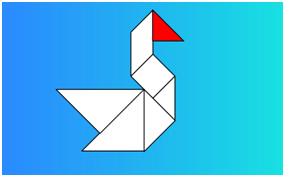
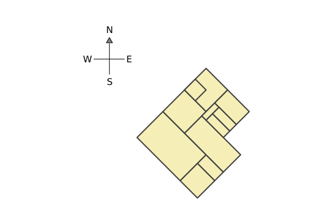
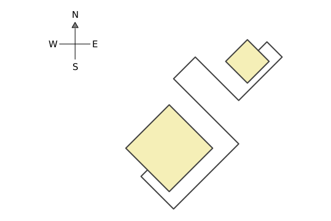

  <a href="/index.html">Home</a> | <a href="index.html">Level 1 Worksheets</a>

## Worksheet 1

Make the following drawings in Kojo using what you have learned in Chapters 1-12 of the [Level 1 book](/tutorials-index.html#lesson-plans).

For quick access to commonly used turtle commands, you can use the [Turtle Graphics Reference](/reference/turtle.html).

### Worksheet Exercises

* Draw a top-view of your house (showing the rooms inside it), keeping in mind its alignment with the compass directions (North, South, etc.).

* Draw the approximate route from your house to your school, keeping in mind its alignment with the compass directions (North, South, etc.).

