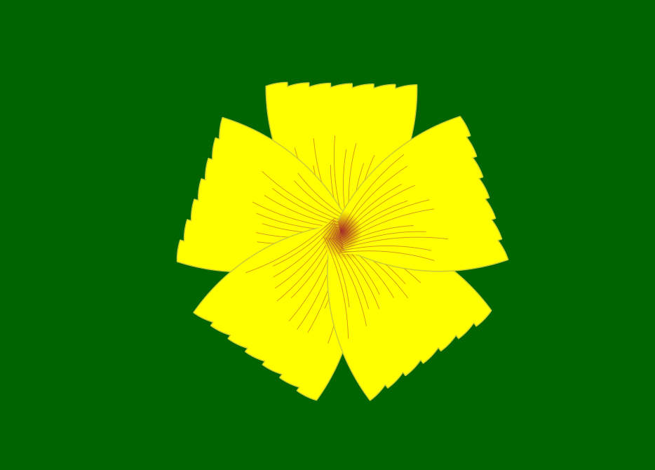
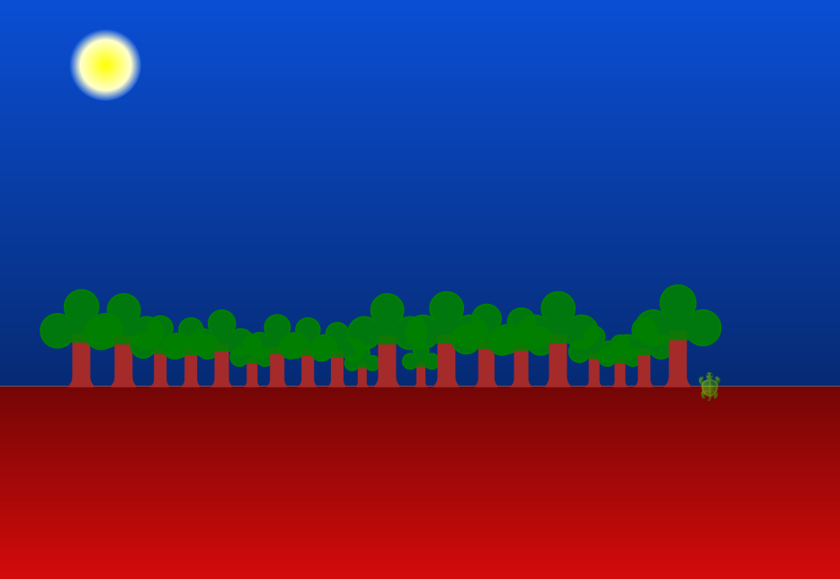
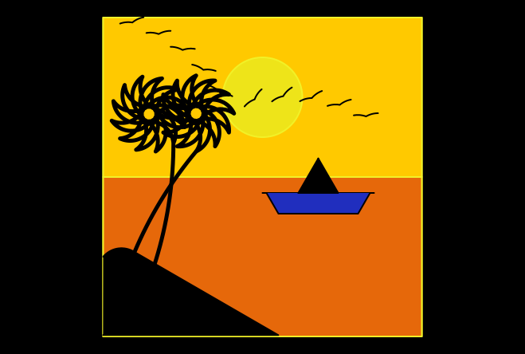

  <a href="/index.html">Home</a> | <a href="index.html">Level 2 Worksheets</a>

## Worksheet 1

Make the following drawings in Kojo:

For quick access to commonly used turtle commands, you can use the [Turtle Graphics Reference](/reference/turtle.html).

### Worksheet Exercises

* This is a fantasy map. Create your own -- with mountains, lakes, rivers, towns, etc...

